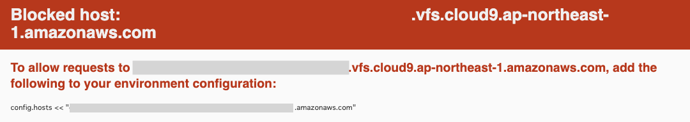

# AWSフルコース（22年9月度）第３回課題
## 課題
- AP サーバーについて調べてみましょう。 
	- AP サーバーの名前とバージョンを確認してみましょう。  
	→ Puma version: 5.6.4 (ruby 2.6.3-p62) ("Birdie's Version")
	- AP サーバーを終了させた場合、引き続きアクセスできますか？  
	→ 無理
- DB サーバーについて調べてみましょう。
	- サンプルアプリケーションで使った DB サーバー(DB エンジン)の名前と、今 Cloud9 で動作しているバージョンはいくつか確認してみましょう。  
	→ MySQL  Ver 8.0.30 for Linux on x86_64 (MySQL Community Server - GPL)
	- DB サーバーを終了させた場合、引き続きアクセスできますか?  
	→ 無理。「ActiveRecord::ConnectionNotEstablished」MySQLに接続できないとエラー画面になる。
- Rails の構成管理ツールの名前は何でしたか？  
→ Bundler

## 今回の課題から学んだことを報告してください。

### 環境構築 手順

1. Cloud9に[サンプルアプリ](https://github.com/yuta-ushijima/raisetech-live8-sample-app)をクローンする。`git clone サンプルアプリのhttps` 
2. 「Cloud9上でのMySQLセットアップ方法」をもとに進める。
	- Cloud9 EBS サイズを16GBに変更（[参考](https://blog.proglus.jp/4574/)）
	- Amazon Linux2なので、MariaDBを削除してMySQLをインストールする
	- 初期パスワードを入手して`config/database.yml`のパスワード欄に記載
	- MySQLの起動を確認
3. サンプルアプリのバージョンに揃える（[参考](https://pikawaka.com/rails/curriculums-rails-basic-aws-cloud9-rails-environment)）
	- railsのバージョン6.1.3.1をインストールする`gem install rails -v '6.1.3.1'`
	- yarnが入ってないのでインストールする`npm install -g yarn`
	- Bundlerをインストール`gem install bundler:2.3.14`
	- Node.jsのバージョンを14.20.1にダウングレードして`nvm install 14`、バージョンを切り替える`nvm use 14`
4. Bundlerでアプリに必要なライブラリをインストールする（[参考](https://pikawaka.com/rails/curriculums-rails-basic-rails-setup#2.Bundler)）
	- ディレクトリ移動`cd raisetech-live8-sample-app`
	- `bundle install`
5. MySQL起動・DB作成
	- `sudo service mysqld start && sudo service mysqld status`
	- `rails db:create`
	- `rails db:migrate`
6. Blocked host対策（エラー１）
	- railsサーバー起動`rails s`
	- `config/environments/development.rb`のend直前に`config.hosts << "〜〜.amazonaws.com"`を追加（エラー画面(Blocked host)の最後の行をコピペ）
7. socketのディレクトリを確認・変更（エラー３）
	- MySQLとアプリを接続する。
	- socketのディレクトリを確認`mysql_config --socket`
	- `config/database.yml`のdevelopmentとtestのsocketを変更
8. webpackをインストールする。（エラー４）
	- `bundle exec rails webpacker:install`
	- Overwriteは全部no
9. ImagaMagicインストール
	- アップロードした画像を表示できるようにする。
	- `sudo yum install -y ImageMagick`


### 出会ったエラー

1. （エラー１）Blocked host


	- `config/environments/development.rb`のend直前に`config.hosts << "〜〜.amazonaws.com"`を追加（エラー画面の最後の行をコピペ） → 解決


2. （エラー２）
```
Puma caught this error: Cannot load database configuration:undefined method \`each' for "窶�# MySQL. Versions 5.5.8 and up are supported.":String (NoMethodError)
```
```
NoMethodError: Cannot load database configuration:undefined method \`each' for "”# MySQL. Versions 5.5.8 and up are supported.":String
```
- MySQLの初期パスワードに#があるのがよくない？ `sudo mysql_secure_installation`で初期パスワードを変更 → 変化なし
- 初期パスワードから#を除いても同じエラーが出る。なぜ。 → 多分自分のミスタッチのせいで`config/database.yml`の文頭に全角の変な誤入力をしていた……。  
- 誤入力を除去 → 解決

3.　（エラー３）
```
ActiveRecord::ConnectionNotEstablished
Can't connect to local MySQL server through socket '/tmp/mysql.sock' (2)
```


- socketのディレクトリが合ってないらしい？（[参考](https://qiita.com/tkmd35/items/c26d1dffca4be0a4f017)）
- `mysql_config --socket`でsocketのディレクトリを確認
- `config/database.yml`のdevelopmentとtestのsocketを`var/lib/mysql/mysql.sock`変更 → 解決

4.　（エラー４）
```
Webpacker::Manifest::MissingEntryError Webpacker can't find application.js
```
- （✖️）Webpackerでコンパイルする（[参考](https://prograshi.com/framework/rails/webpackermanifestmissingentryerror/)）  
	`rails assets:precompile` → これだとアプリ起動はできるようになるものの、JavaScriiptが機能せずレイアウトが崩れる。
- （◯）webpackerをインストールする
	- `bundle exec rails webpacker:install`  （22年9月第3回講義動画2:18:00〜）
	- Overwriteは全部no
```
Overwrite /home/ec2-user/environment/raisetech-live8-sample-app/config/webpacker.yml? (enter "h" for help) [Ynaqdhm] n
Overwrite /home/ec2-user/environment/raisetech-live8-sample-app/config/webpack/environment.js? (enter "h" for help) [Ynaqdhm] n
Overwrite /home/ec2-user/environment/raisetech-live8-sample-app/babel.config.js? (enter "h" for help) [Ynaqdhm] n
```

動いたー！


### 起動手順
1. ディレクトリ移動`cd raisetech-live8-sample-app`
2. MySQL起動`sudo service mysqld start && sudo service mysqld status`
3. railsサーバー起動`rails s`
