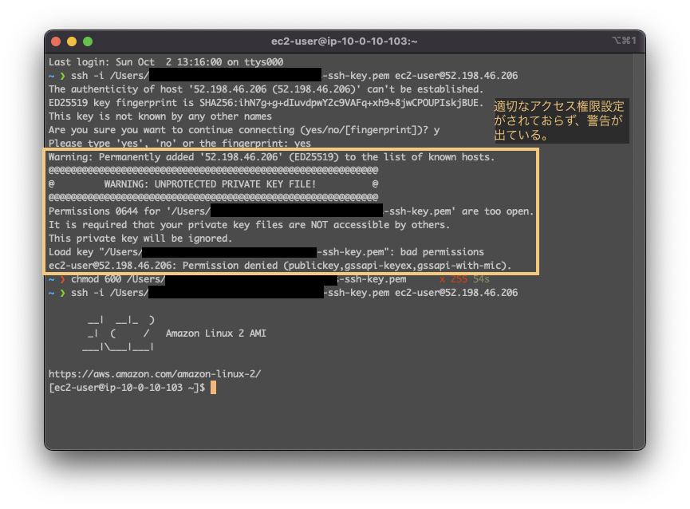
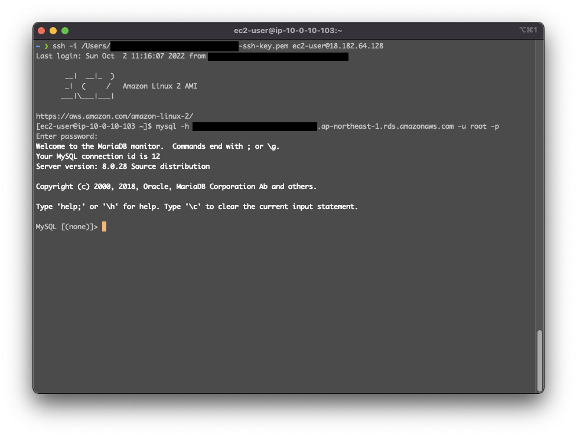
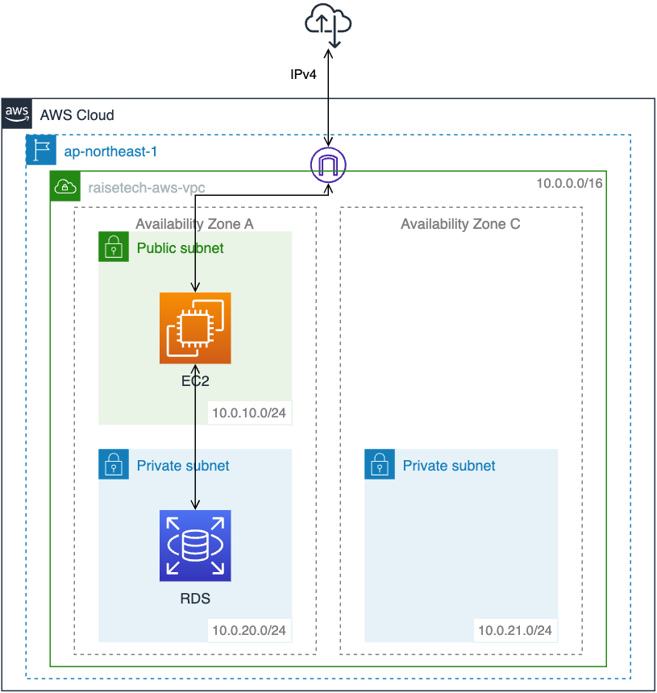

# AWSフルコース（22年9月度）第４回課題
## 課題
- AWS上に新しく VPC を作ってください。
- EC2 と RDS を構築してください
- EC2 から RDS へ接続をし、正常であることを確認して報告してください。 


## 1. VPCとサブネットの作成
（[参考１](https://docs.aws.amazon.com/ja_jp/AmazonRDS/latest/UserGuide/CHAP_Tutorials.WebServerDB.CreateVPC.html)）（[参考２](https://dev.classmethod.jp/articles/sales-create-ec2/)）

#### 1-1. VPCを作成する
- 東京リージョン（ap-northeast-1）を選択する。
- ［IPv4 CIDR の手動入力］10.0.0.0/16
	- IPアドレスの範囲は作成後は変更できないので、大きめに設定する。CIDRブロックは/16推奨

#### 1-2. サブネットを作成する
- **パブリックサブネット**
	- ［VPC ID］1-1.で作成したVPCを選択
	- ［アベイラビリティーゾーン］ap-northeast-1a
	- ［IPv4 CIDR ブロック］10.0.10.0/24
		- 将来必要なIPアドレス数を見積もって設定する。CIDRブロックは/24が標準的
- **プライベートサブネット**
	- ［VPC ID］1-1.で作成したVPCを選択
	- ［アベイラビリティーゾーン］ap-northeast-1a
	- ［IPv4 CIDR ブロック］10.0.20.0/24

#### 1-3. ルーティングを設定する
パブリックサブネットからインターネットに接続できるようにする。（[参考１](https://docs.aws.amazon.com/ja_jp/vpc/latest/userguide/VPC_Internet_Gateway.html)）（[参考２](https://dev.classmethod.jp/articles/sales-create-ec2/)）

- **インターネットゲートウェイを作成し、VPCにアタッチする。**
	- インターネットゲートウェイを作成する。
	- VPCにアタッチする。
		- ［アクション］-［VPCにアタッチ］を選択
		- ［VPC］1-1.で作成したVPCを選択
- **ルートテーブルを作成し、パブリックサブネットに紐づける。**
	- ルートテーブルを作成する。
		- ［VPC］1-1.で作成したVPCを選択
	- パブリックサブネットに紐づける。
		- ［サブネットの関連付け］-［サブネットの関連付けを編集］を選択
		- 1-2.で作成したパブリックサブネットを選択
	- デフォルトルートをインターネットゲートウェイに設定する。
		- ［ルート］-［ルートの編集］-［ルートの追加］
		- 先のIPアドレスと次のルーター（AWSだとターゲット）
		- ［送信先］0.0.0.0/0（デフォルトルート：ルートテーブルに登録されているどのアドレスにも一致しない場合の経路。）
		- ［ターゲット］1-3.で作成したインターネットゲートウェイを選択


## 2. EC2構築

#### 2-1. EC2インスタンスを設置する
- ［インスタンスを起動］からEC2インスタンスを作成する。
	- **名前とタグ**
		- ［キー］Name
		- ［値］任意のインスタンス名
		- ［リソースタイプ］インスタンス
	- **アプリケーションおよび OS イメージ (Amazon マシンイメージ)（AMIの選択）**
		- ［その他のAMIを閲覧する］→［クイックスタート］→［Amazon Linux 2 AMI (HVM) - Kernel 5.10, SSD Volume Type（64 ビット (x86)）］
	- **インスタンスタイプ**：CPU、メモリ、ストレージ、ネットワーク帯域
		- ［インスタンスタイプ］t2.maicro
	- **キーペア（ログイン）**：SSH秘密鍵
		- ［キーペアのタイプ］RSA
		- ［プライベートキーファイル形式］.pem
	- **ネットワーク設定**
		- ［編集］をクリック
		- ［VPC］1-1.で作成したVPCを選択
		- ［サブネット］1-2.で作成したパブリックサブネットを選択
		- ［パブリック IP の自動割り当て］有効（グローバルIPアドレスから接続できるようになる）
		- ［ファイアウォール（セキュリティグループ）］セキュリティグループを作成する
		- セキュリティグループのルール１
			- ［タイプ］ssh
			- ［ソースタイプ］カスタム
			- ［ソース］0.0.0.0/0
	- **ストレージを設定**
		- ［EBS ボリューム］ボリューム 1 (AMI ルート) (8 GiB, EBS, 汎用 SSD (GP2))
			- EBS（※通常はこちらを使う）
				- 別途費用が発生
				- 高い可用性と耐久性を持つ
				- OSやDBを置く
			- インスタンスストア
				- 追加料金なし
				- 一時的なストレージなのでデータは消える
				- キャッシュなどを置く
	- **概要**
		- ［インスタンス数］1

#### 2-2. SSHでEC2インスタンスに接続する（[参考](https://docs.aws.amazon.com/ja_jp/AWSEC2/latest/UserGuide/AccessingInstancesLinux.html)）
- ターミナルにて、秘密鍵の権限をオーナー以外読み書きできないように強化する。

```
chmod 600 /秘密鍵を保存しているディレクトリ/●●●●.pem
```
※これをしないと`WARNING: UNPROTECTED PRIVATE KEY FILE!`となり、EC2にログインできない。([参考](https://qiita.com/leomaro7/items/662699dcb7a7adc36f40))


- AWSマネジメントコンソールにて、インスタンスのIPv4パブリックIP（パブリックIPアドレス）を確認してコピーする。　　
このパブリックIPアドレスにSSHでログインをリクエストする。  
（インスタンスを再起動するとパブリックIPアドレスは変わる）

- ターミナルにて、秘密鍵を用いてサーバーにログインをリクエストする。

```
ssh -i /秘密鍵を保存しているディレクトリ/●●●●.pem ec2-user@IPv4パブリックIP（パブリックIPアドレス）
```

```
（初回のみ）
Are you sure you want to continue connecting (yes/no/[fingerprint])? yes
```

- 接続完了
- `exit`でサーバーとの接続が切れる。
- サーバー上で誤入力すると怖いので作業が終わったらすぐログアウトする。


## 3.　RDS（DBサーバー）構築手順

#### 3-1. RDSの設置（[参考１](https://docs.aws.amazon.com/ja_jp/AmazonRDS/latest/UserGuide/USER_VPC.Scenarios.html#USER_VPC.Scenario1)）（[参考２](https://dev.classmethod.jp/articles/sales-rds-ec2-session/)）
- **RDSの作成準備**
	- **プライベートサブネットの作成**
		- RDS作成するには複数のAvailability Zoneにサブネットが作成されていないといけない。
		- メインのDBを設置しているAZとは別のAZに作成する。
		- プライベートサブネット
			- ［VPC ID］1-1.で作成したVPCを選択
			- ［アベイラビリティーゾーン］ap-northeast-1c
			- ［IPv4 CIDR ブロック］10.0.21.0/24
	- **セキュリティグループの作成（EC2）**（[参考](https://docs.aws.amazon.com/ja_jp/AmazonRDS/latest/UserGuide/Overview.RDSSecurityGroups.html)）
		- 必要なところからしかアクセスできないようにする。
		- WEBサーバからRDSに、MySQLでのみ接続できるようにする。
			- ［VPC］1-1.で作成したVPCを選択
			- ［タイプ］MYSQL/Aurora
			- ［ソース］カスタム、EC2作成時のセキュリティグループを選択
		- ソースにEC2のセキュリティグループを指定することで、セキュリティグループ内のインスタンスから接続できるようになる。（個別にIPアドレスを指定しなくても良くなる）
	- **DBサブネットグループの作成**
		- VPC内にあるサブネットを複数指定してRDSを起動するサブネットを指定する
	- **DBパラメータグループの作成**
		- DBの設定値を指定する。
	- **DBオプショングループの作成**
		- DBの機能的な部分を設定する。プラグインの使用等。

- **RDSの作成**
	- ［データベース作成方法を選択］標準作成
	- ［エンジンのオプション］MySQL
	- ［バージョン］8.0.28
	- ［テンプレート］無料利用枠
	- 接続
		- ［コンピューティングリソース］EC2 コンピューティングリソースに接続しない
		- ［Virtual Private Cloud (VPC)］1-1.で作成したVPCを選択
		- ［DB サブネットグループ］作成したサブネットグループを選択
		- ［パブリックアクセス］なし
		- ［VPC セキュリティグループ (ファイアウォール)］既存の選択
		- ［既存の VPC セキュリティグループ］作成したセキュリティグループを選択
		- ［アベイラビリティーゾーン］ap-northeast-1a


#### 3-2. WEBサーバーからRDSに接続（[参考](https://docs.aws.amazon.com/ja_jp/AmazonRDS/latest/UserGuide/USER_ConnectToInstance.html#USER_ConnectToInstance.CLI)）
- ターミナルにて、EC2インスタンスにMySQLをインストールする。```sudo yum -u install mysql```
- AWSマネジメントコンソールにて、RDSのエンドポイントを確認、コピーする。
- ターミナルにて、MySQLでRDSに接続する。`mysql -h コピーしたエンドポイント -u root -p`

## EC2 から RDS に接続完了


## 構成図


## 用語

- 0.0.0.0/0（デフォルトルート）：ルートテーブルに登録されているどのアドレスにも一致しない場合の経路。
- インターネットゲートウェイ（IGW）：VPCとインターネットを繋げる仮想のルーター
- EC2：仮想サーバー
- インスタンス：EC2から立てられたサーバのこと
- SSH
	- サーバーと自分のパソコンをセキュアに繋ぐサービス。通信内容が暗号化された遠隔ログインシステム
	- 公開鍵認証
		- サーバーへのログイン時に認証を行う仕組み。
		- 秘密鍵と公開鍵を用いる。
		- 公開鍵はサーバーが保有。秘密鍵（pemファイル）を持っているユーザーだけがログイン可能

## EC2アクセス手順
1. AWSマネジメントコンソールにてEC2インスタンスを開始する。
2. パブリック IPv4 アドレスをコピーする。
3. ターミナルから起動`ssh -i /秘密鍵を保存しているディレクトリ/●●●●.pem ec2-user@IPv4パブリックIP（パブリックIPアドレス）`