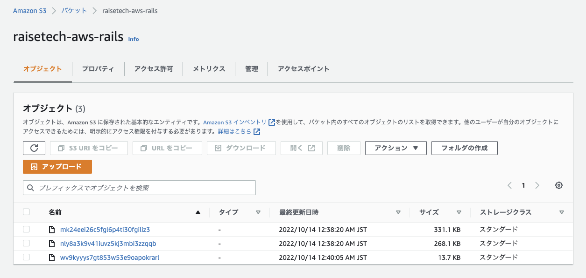

# AWSフルコース（22年9月度）第５回課題
## 課題
- EC2 上にサンプルアプリケーションをデプロイして、動作させてください。
- まずは組み込みサーバーだけで、動作したらサーバーアプリケーションを分けて動くかチャレンジしてみましょう。
- 動作したら、ELB(ALB)を追加してみましょう。
- ELB を加えて動作が確認できたら、さらに S3 を追加してみましょう。S3 をどのように使うかはお任せします。
- ここまでが問題無く動作したら、その環境を構成図に書き起こしてください。
---


## 目次
[1. EC2インスタンスの環境構築](#1-ec2インスタンスの環境構築)  
[2. EC2インスタンスにデプロイする](#2-ec2インスタンスにデプロイする)  
[3. EC2の組み込みサーバーからRDSを使ってアプリを動かす](#3-ec2の組み込みサーバーからrdsを使ってアプリを動かす)  
[4. Web サーバー(Nginx)、AP サーバー(Unicorn)でアプリを動かす](#4-web-サーバーnginxap-サーバーunicornでアプリを動かす)  
[5. ELB(ALB)を追加する](#5-elbalbを追加する)  
[6. S3 を追加する](#6-s3-を追加する)  
[7. 構成図](#7-構成図)  
[8. 出会ったエラー](#8-出会ったエラー)  
[9. わからなかったこと、やり残したこと](#9-わからなかったことやり残したこと)  


※ 全て開発環境です。

## 1. EC2インスタンスの環境構築
（[参考１](https://www.youtube.com/watch?v=DYoXhTUfm98)、[２](https://hackmd.io/4_1NYUTBSaSsOC8cur7WhA?view)、[３](https://qiita.com/Yuki_Nagaoka/items/dbb185feb6d4f051c2f2)、[４](https://qiita.com/1000ch/items/a61e65fe82d8bdea840e)、[５](https://pikawaka.com/rails/ec2_deploy#%E4%BD%9C%E6%88%90%E3%81%97%E3%81%9F%E3%82%A4%E3%83%B3%E3%82%B9%E3%82%BF%E3%83%B3%E3%82%B9%E3%81%AE%E7%92%B0%E5%A2%83%E6%A7%8B%E7%AF%89%E3%82%92%E3%81%97%E3%82%88%E3%81%86)、[６](https://qiita.com/gyu_outputs/items/b123ef229842d857ff39#ec2の環境構築ruby-mysql-etc)）
#### 1-1. 必要なパッケージのインストール
```
$ sudo yum update
$ sudo yum -y install git make gcc-c++ patch openssl-devel libyaml-devel libffi-devel libicu-devel libxml2 libxslt libxml2-devel libxslt-devel zlib-devel readline-devel ImageMagick ImageMagick-devel
```
sudo yum -y install mysql-server mysql-devel

#### 1-2. rbenv（rubyのバージョン管理ツール）のインストール
```
$ git clone https://github.com/rbenv/rbenv.git ~/.rbenv
```

#### 1-3. rbenvにパスを通す
```
$ echo 'export PATH="$HOME/.rbenv/bin:$PATH"' >> ~/.bash_profile
$ echo 'eval "$(rbenv init -)"' >> ~/.bash_profile
$ source ~/.bash_profile
```

#### 1-4. ruby-build （rubyのインストールに必要）をインストールする
```
$ git clone https://github.com/rbenv/ruby-build.git ~/.rbenv/plugins/ruby-build
```

#### 1-5. rubyのインストール（バージョンは 2.6.3 ）
```
$ rbenv install 2.6.3
$ rbenv global 2.6.3 # 使う Ruby の指定
$ rbenv rehash
$ ruby -version
```

#### 1-6.rails のインストール（バージョンは 6.1.3.1 ）
```
$ gem install rails -v '6.1.3.1'
$ rails --version
```

#### 1-7. node.js のインストール（バージョンは 14.20.1 ）
```
$ curl --silent --location https://rpm.nodesource.com/setup_14.x | sudo bash - # AWSのリポジトリに追加
$ sudo yum install -y nodejs
$ node --version
```

#### 1-8. yarn のインストール
```
$ curl -sL https://dl.yarnpkg.com/rpm/yarn.repo | sudo tee /etc/yum.repos.d/yarn.repo # AWSのリポジトリに追加
$ sudo yum -y install yarn
$ yarn --version
```

#### 1-9.bundlerをインストール（バージョンは 2.3.14 ）
```
$ gem install bundler:2.3.14
```


## 2. EC2インスタンスにデプロイする

#### 2-1. ディレクトリの作成
- アプリを配置するディレクトリを作成する。`sudo mkdir /var/www/`
- 権限を変更する。これを行わないと、GitHubからのクローンができない。`sudo chown ec2-user /var/www/`
- 作成したディレクトリに移動する`cd /var/www/`

#### 2-2. サンプルアプリをクローンする。
- [サンプルアプリ](https://github.com/yuta-ushijima/raisetech-live8-sample-app)をクローンする。`git clone サンプルアプリのhttps`

#### 2-3. Bundlerでアプリに必要なライブラリをインストールする。
- ディレクトリ移動`cd raisetech-live8-sample-app`
- `bundle install`


## 3. EC2の組み込みサーバーからRDSを使ってアプリを動かす
（[参考１](https://abillyz.com/moco/studies/119)、[２](https://qiita.com/nekonoprotocol/items/26601d87f5b1642a1c1b#2-4)、[３](https://nishinatoshiharu.com/rails-ec2-rds/#i-4)）

#### 3-1. MySQLのインストール
```
MYSQL_PACKAGE_URL="https://dev.mysql.com/get/mysql80-community-release-el7-7.noarch.rpm"
sudo yum localinstall -y $MYSQL_PACKAGE_URL
sudo yum install -y mysql-community-devel
sudo yum install -y mysql-community-server
```

#### 3-2. MySQLサーバーの起動＆確認
```
$ sudo service mysqld start && sudo service mysqld status
```

#### 3-3. config/database.yml の編集。
- `vim config/database.yml`で`config/database.yml`を編集する。
- ユーザ名とパスワード欄にRDSのものを記入する。
- hostにRDSのエンドポイントを記入し、DBの接続先をRDSに切り替える。
- socketのディレクトリを`mysql_config --socket`で確認し、developmentとtestのsocketを変更する。
  - username: XXXXX
  - password: XXXXX
  - host: RDSのエンドポイント
  - socket: 


#### 3-4. ポートを開放する
- HTTPがつながるように「ポート」を開放する必要がある。
- EC2のセキュリティグループ内の「インバウンド」-「インバウンドルールを編集」
	- タイプ：カスタムTCP
	- プロトコル：TCP
	- ポート範囲：3000
	- 送信元：カスタム/0.0.0.0/0

#### 3-5. データベースの作成
- `$ rails db:create`　（※ これはdevelopmentとtestのDB作成）
- `$ rails db:migrate` 

#### 3-6. Webpackerのインストール
- `$ bundle exec rails webpacker:install`
- Overwriteは全部no


#### 3-7. rails を起動する
- railsを起動する（[参考](https://qiita.com/sakaimo/items/dd138b39c7480fb2ebff)）


```
$ bundle exec rails s -b 0.0.0.0
# これはdevelopmentで起動
```

- `http://(EC2インスタンスのパブリックIPアドレス):3000`にアクセスする。

→組み込みサーバーで動いた！！


## 4. Web サーバー(Nginx)、AP サーバー(Unicorn)でアプリを動かす

### 4-1. nginxの設定
（[参考１](https://qiita.com/gyu_outputs/items/b123ef229842d857ff39#nginx)、[２](https://qiita.com/shinyashikis@github/items/ace49154f0c71c65b2c9)）

- サーバーをアップデートする。`$ sudo yum update`
- Nginxをインストールして`$ sudo amazon-linux-extras install nginx1 -y`、バージョン確認`$ nginx -v`
- ポート80を解放する。（[3-4.](#3-4-ポートを開放する)参照）
- Nginxを起動`$ sudo systemctl start nginx`
- インスタンス起動時に自動起動するよう設定

```
$ sudo systemctl enable nginx
$ systemctl status nginx
```

- Nginxの設定ファイルを作成する`$ sudo vi /etc/nginx/conf.d/〇〇〇〇〇<アプリケーション名>.conf`

```
upstream unicorn_server {
	# Unicornと連携させるための設定。
  # config/unicorn.rb内のunicorn.sockを指定する
  server unix:/var/www/raisetech-live8-sample-app/unicorn.sock;
}

server {
  listen 80;
  # 接続を受け付けるリクエストURL ここに書いていないURLではアクセスできない
  server_name 〇〇.〇〇.〇〇.〇〇＜EC2インスタンスのパブリックIPアドレス＞;

  client_max_body_size 2g;

  # 接続が来た際のrootディレクトリ
  root /var/www/〇〇〇〇〇<アプリケーション名>/public;

  # assetsファイル(CSSやJavaScriptのファイルなど)にアクセスが来た際に適用される設定
  location ^~ /assets/ {
    gzip_static on;
    expires max;
    add_header Cache-Control public;
  }

  try_files $uri/index.html $uri @unicorn;

  location @unicorn {
    proxy_set_header X-Forwarded-For $proxy_add_x_forwarded_for;
    proxy_set_header Host $http_host;
    proxy_redirect off;
    proxy_pass http://unicorn_server;
  }

  error_page 500 502 503 504 /500.html;
}
```

- 権限の変更
	- `$ cd /var/lib`
	- `$ sudo chmod -R 775 nginx`

- Nginxを再起動して設定ファイルを再読み込み
	- `$ cd ~`
	- `$ sudo systemctl restart nginx`


#### 4-2. Unicornの設定
- サンプルアプリにはGemfileにunicoenについてあらかじめ記載があるため、既に先の`$ bundle install`でインストール済み。
- サンプルアプリにはconfig/unicorn.rbもあらかじめ作成済みなため、作成不要。
- config/unicorn.rb内のディレクトリを自分の環境に合わせて修正する。`$ vim config/unicorn.rb`

```
（5-6行目）
listen '/var/www/raisetech-live8-sample-app/unicorn.sock'
pid    '/var/www/raisetech-live8-sample-app/unicorn.pid'
```

#### 4-3. アプリを起動する。
- Nginxを起動`$ sudo service nginx start`
- Unicornを起動する`$ bundle exec unicorn_rails -c config/unicorn.rb -D` ※これは開発環境
- Unicornの起動を確認する`$ ps aux | grep unicorn`

→ Unicorn + Nginxで動いた！


## 5. ELB(ALB)を追加する
#### 5-1. パブリックサブネットを追加作成する
- VPCダッシュボードから［サブネット］をクリック
- ［サブネットを作成］をクリック
	- ［名前タグ］任意の名前
	- ［VPC ID］現在使用しているVPCを選択
	- ［アベイラビリティーゾーン］ap-northeast-1c
	- ［IPv4 CIDR ブロック］10.0.11.0/24

#### 5-2. インターネットゲートウェイをアタッチする
- 作成したパブリックサブネットを選択し、［ルートテーブル］-［ルートテーブルの関連付け］-［ルートテーブルの関連付けを編集］をクリック
- ［ルートテーブルID］現在使用しているインターネットゲートウェイを選択

#### 5-3. ELBの作成
- EC2ダッシュボードから［ロードバランサー］-［ロードバランサーの作成］をクリック
- ALBを選択
	- Basic configuration
		- ［名前］任意の名前
		- ［スキーム］インターネット向き
		- ［IPアドレスタイプ］	ip4
	- Network mapping
		- ［VPC］現在使用しているVPC
		- ［1a-northeast-1a］1aのパブリックサブネット
		- ［1a-northeast-1c］1cのパブリックサブネット
	- Security groups
		- ［セキュリティーグループの割り当て］新しいセキュリティーグループを作成する
		- ［セキュリティーグループ名］任意の名前
		- インバウンドルールを追加
			- ［タイプ］HTTP
			- ［プロトコル］TCP
			- ［ポート範囲］80
			- ［ソート］0.0.0.0/0
	- Listeners and routing
		- ［ロードバランサーのプロトコル］HTTP
		- ［ロードバランサーのポート］80
	- ルーティングの設定
		- ［ターゲットグループ］新しいターゲットグループ
		- ［名前］任意の名前
		- ［ターゲットの種類］インスタンス
		- ［プロトコル］HTTP1
		- ［ポート］80
	- ヘルスチェック
		- ［プロトコル］HTTP
		- ［パス］/
		-　ヘルスチェックの詳細設定　※本番は特に変更なしでも可
			- ［ポート］トラフィックポート
			- ［正常のしきい値］2
			- ［非正常のしきい値］2
			- ［タイムアウト］5
			- ［間隔］10
			- ［成功コード］100
		- ターゲットの登録
			- 該当するEC2インスタンスを選択し［登録済みに追加］
- DNS名のURLをコピーし、DNSからアクセスする

- Blocked hostが発生したので、`config/environments/development.rb`のend直前に`config.hosts << "〜〜.amazonaws.com"`を追加（エラー画面(Blocked host)の最後の行をコピペ）
- Nginx と Unicorn を再起動
- ELB の DNS名 でアプリにアクセスする

→ ELBを挟んでも動いた！


ヘルスチェック


## 6. S3 を追加する
- S3のよくある利用シーン
	- 静的コンテンツの配信（img画像をS3から配信する）
	- バッチ連携用のファイル置き場
	- ログなどの出力先
	- 静的ウェブホスティング（静的ウェブサイトをS3から公開する）

- 今回はアプリにアップロードしたimg画像をS3に保存する。
- アクセスルート「EC2 → Internet Gateway → S3」（[参考](https://tech.nri-net.com/entry/access_routes_from_EC2_to_S3)）


### 6-1. AWS側の準備
#### 6-1-1. S3バケットの作成
- S3ダッシュボードから［バケット］-［バケットを作成する］をクリック
	- 一般的な設定
		- ［バケット名］任意の名前
		- ［AWSリージョン］VPCと同じ
	- オブジェクト所有者
		- ［ACL 無効 (推奨)］を選択
	- このバケットのブロックパブリックアクセス設定
		- ［パブリックアクセスをすべて ブロック］チェックを外す
		- ［現在の設定により、このバケットとバケット内のオブジェクトが公開される可能性があることを承認します。］チェックする
	- バケットのバージョニング
		- ［バージョニング］無効にする（本番では有効にした方がいい）
	- デフォルトの暗号化
		- ［サーバー側の暗号化］無効にする
	- 詳細設定
		- ［オブジェクトロック］無効にする


**※※「オブジェクトは公開することができます」になっていることを要確認 ※※**


- ［オブジェクトレベルのログの記録］無効
- ［CloudWatchリクエストメトリクス］無効
- ［システムのアクセス許可の管理］付与する


#### 6-1-2. S3の権限を持ったIAMを作成
- IAMダッシュボードから［ユーザー］-［ユーザーを追加］をクリック
	- ［ユーザー名］任意の名前
	- ［AWS 認証情報タイプを選択］アクセスキー - プログラムによるアクセス
	- ［アクセス許可の設定］既存のポリシーを直接アタッチ
		- ［AmazonS3FullAccess］を選択
	- 作成したら［.csvファイルをダウンロード］する

### 6-2. railsアプリの設定
- サンプルアプリにはGemfileに`aws-sdk-s3`についてあらかじめ記載があるため、既に先の`$ bundle install`でインストール済み。（[参考](https://qiita.com/daichi41/items/af2a56ea46c13ca55fd3)）

#### 6-2-1. credentials.yml.encとmaster.keyを新規に作成する。
- 今回はmaster.keyが不明なため、新規に作成する。（[参考１](https://qiita.com/Nedward/items/d9da3867af6d50e4213e)、[２](https://qiita.com/jnchito/items/a73bc2838bfab5240675)）
- 既存のcredentials.yml.encを削除する。`$ rm config/credentials.yml.enc`
- credentials.yml.encとmaster.keyを新規に作成する。`$ EDITOR="vi" bin/rails credentials:edit`


#### 6-2-2. `/config/storage.yml`に合わせて、`credentials.yml.enc`にIAMユーザー作成時にダウンロードした認証情報を記載する。
`$ EDITOR="vi" bin/rails credentials:edit`
```
aws:
  access_key_id: 〇〇〇〇〇
  secret_access_key: 〇〇〇〇〇
  active_storage_bucket_name: 〇〇〇〇〇
```

#### 6-2-3. config/environments/development.rbを編集する
- 画像の保存先S3に変更する。
- config/environments/development.rbを編集する`$ vim config/environments/development.rb`

```
（変更前）config.active_storage.service = :local
　↓
（変更後）config.active_storage.service = :amazon
```

### 6-3. バケットのアクセス許可設定
#### 6-3-1. バケットポリシーの設定
- S3ダッシュボードから［バケット］をクリックし、作成したバケットを選択する。
- ［アクセス許可］-［バケットポリシー］-［編集］をクリック
- 下記のJSONを入力する。（[参考１](https://qiita.com/iwkmsy9618/items/d277f5f6f3991ada70f1#%E3%83%90%E3%82%B1%E3%83%83%E3%83%88%E3%83%9D%E3%83%AA%E3%82%B7%E3%83%BC)、[２](https://qiita.com/irico/items/a3ab1f8ebf1ece9cc783)）

```
{
    "Version": "2012-10-17",
    "Statement": [
        {
            "Sid": "Statement1",
            "Effect": "Allow",
            "Principal": {
                "AWS": "〇〇〇〇〇＜S3用に作成したIAMユーザーのARN＞"
            },
            "Action": "S3:*",
            "Resource": [
                "arn:aws:s3:::〇〇〇〇〇＜S3のバケット名＞",
                "arn:aws:s3:::〇〇〇〇〇＜S3のバケット名＞/*"
            ]
        }
    ]
}
```

#### 6-3-2. CORS ルールの設定
- S3ダッシュボードから［バケット］をクリックし、作成したバケットを選択する。
- ［アクセス許可］-［Cross-Origin Resource Sharing (CORS)］-［編集］をクリック
- 下記のJSONを入力する。

```
[
    {
        "AllowedHeaders": [
            "*"
        ],
        "AllowedMethods": [
            "GET",
            "POST",
            "PUT",
            "DELETE",
            "HEAD"
        ],
        "AllowedOrigins": [
            "〇〇〇〇〇＜ELBのDNS名＞"
        ],
        "ExposeHeaders": [
            "Access-Control-Allow-Origin"
        ]
    }
]
```

- ［AllowedOrigins］のDNS名末尾には絶対に/（スラッシュ）を入れない。入れたらプリフライトリクエストで「Access-Control-Allow-Origin」が存在しないとブロックされる。（エラー３）

### 6-4. アプリを起動し、新規作成する。
→ S3に保存できた！

アプリ経由でS3に保存された画像一覧



## 7. 構成図


## 8. 出会ったエラー

エラー１、エラー２について、最終的にEC2インスタンスをイチから作成し直したところ、なんのエラーにも出会わずすんなりアプリが起動したため、根本原因は不明。

<details>
<summary><h4>（エラー１）組み込みサーバーにアプリをデプロイする際のNoMethodError</h4></summary>

- 何をやっても`Cannot load database configuration`が出続けて、アプリとMySQLが接続できない。
- `rails db:create`も`rails db:migrate`も、挙句には`bin/rails webpacker:install`も`rails c`も

```
/home/ec2-user/.rbenv/versions/2.6.3/lib/ruby/gems/2.6.0/gems/railties-6.1.3.1/lib/rails/application/configuration.rb:277:in `database_configuration': Cannot load database configuration:
undefined method `each' for "/tmp/mysql.sock# MySQL. Versions 5.5.8 and up are supported.":String (NoMethodError)
```

か

```
rails aborted!
NoMethodError: undefined method \`flat_map' for "/tmp/mysql.sock# MySQL. Versions 5.5.8 and up are supported.":String
```

が出続ける。おかしい。


#### （解決策）config/database.ymlのコメントアウトを全て削除
めちゃめちゃハマった。本当に沼った。

→ 色々やったけど、`database configuration`はやっぱり`config/database.yml`がおかしいらしい。  
→ コメントアウトも拾うらしい。([参考](https://qiita.com/kumashun/items/8e80019673b1cf7036a4))  
→ コメントアウト全部消したろ。  

→ 解決！！！！！！！！！！！気が狂うかと思った

ちなみに、コメントアウトをサンプルアプリのGithubからコピペして戻したところ、エラーになることもなく問題なく動作したので、どこが問題だったか不明。  
第３回課題に引き続き、もしかしたらまたミスタッチで誤入力したのかもしれない……。

#### （やったけど効果なかったこと１）データべース接続ユーザーの作成と権限付与してみる。 → 変化なし
- MySQLに接続する
- 接続ユーザーを作成する`CREATE USER 'webuser'@'%' IDENTIFIED BY 'webpass';`
- 権限を付与する`GRANT SELECT, INSERT, UPDATE, DELETE, CREATE, DROP, RELOAD, PROCESS, REFERENCES, INDEX, ALTER, SHOW DATABASES, CREATE TEMPORARY TABLES, LOCK TABLES, EXECUTE, REPLICATION SLAVE, REPLICATION CLIENT, CREATE VIEW, SHOW VIEW, CREATE ROUTINE, ALTER ROUTINE, CREATE USER, EVENT, TRIGGER ON *.* TO 'webuser'@'%' WITH GRANT OPTION;`
- 設定を反映する`FLUSH PRIVILEGES;`
- 作成されたか確認する`SELECT user, host FROM mysql.user;`


#### （やったけど効果なかったこと２）エラー文にやたら存在しない`/tmp/mysql.sock`が出てくるので、socketの位置を書き換えてみる。 → 変化なし
- MySQLを停止し`$ sudo service mysqld stop`、/etc/my.cnfを編集する`$ vim /etc/my.cnf`。（[参考１](https://urashita.com/archives/32590)、[２](https://beyondjapan.com/blog/2016/03/2002-mysql-socket-error/#2_MySQLUnixUnix)、[３](https://qiita.com/toshihirock/items/c5933d3628c7d4e81ffa)）
- socketのディレクトリを`socket=/var/lib/mysql/mysql.sock`に書き換える。 → 元からこれだった……。

#### （やったけど効果なかったこと３）credentials.yml.encとmaster.keyを新規に作成して編集してみる。 → 変化なし
（[参考１](https://qiita.com/Nedward/items/d9da3867af6d50e4213e)、[２](https://qiita.com/jnchito/items/a73bc2838bfab5240675)）
```
$ rm config/credentials.yml.enc
$ EDITOR="vi" bin/rails credentials:edit
Adding config/master.key to store the encryption key: 3bc8b8c69024cae157e0ed695bfa7625

Save this in a password manager your team can access.

If you lose the key, no one, including you, can access anything encrypted with it.

      create  config/master.key

Couldn't decrypt config/credentials.yml.enc. Perhaps you passed the wrong key?
```

</details>

<details>
<summary><h4>（エラー２）エラー１解決後、アプリが起動しなくなる</h4></summary>

#### 今度はアプリが起動しなくなる
エラー１の時、まだrailsは起動していたが、起動すらしなくなる。

```
$ bin/rails s -b 0.0.0.0
=> Booting Puma
=> Rails 6.1.3.1 application starting in development
=> Run `bin/rails server --help` for more startup options
Exiting
（中略）
config.ru:4:in `require_relative': cannot load such file -- /var/www/raisetech-live8-sample-app/lib/rack/health_check (LoadError)
```

rubyをアンインストールして、rubyとrailsのインストールと`bundle install`をやり直す。  
→ メモリ不足？で何回やっても`bundle install`が途中でkilledされる。  
→ もうEC2インスタンス作成し直すぞ。  
→ なんのエラーにも出会わず、すんなりアプリが起動。なんで！

</details>

<details>
<summary><h4>（エラー３）アプリからS3に画像を保存できない</h4></summary>

#### 新規作成時、「Error storing "（ファイル名）". Status: 0」と言われて画像を保存できない。

- CORSを設定する（[参考１](https://aws.amazon.com/jp/premiumsupport/knowledge-center/s3-configure-cors/)、[２](https://ja.stackoverflow.com/questions/88072/s3%E3%81%AB%E7%94%BB%E5%83%8F%E3%83%95%E3%82%A1%E3%82%A4%E3%83%AB%E3%82%92%E3%82%A2%E3%83%83%E3%83%97%E3%83%AD%E3%83%BC%E3%83%89%E3%81%A7%E3%81%8D%E3%81%AA%E3%81%84)）→ 変化なし
- chrome開発者ツールだとプリフライトリクエストでブロックされてる。
- curlででCORSリクエストの再現してバケットにアクセスする（[参考](https://qiita.com/Ping/items/29f0ed49b769a9dd3d3e)）と、レスポンスヘッダーに「Access-Control-Allow-Origin」が存在しない。（S3バケットのCORSでは設定済み）

```
$ curl -v -X OPTIONS -H 'Origin:http://〇〇〇〇〇.ap-northeast-1.elb.amazonaws.com/' -H 'Access-Control-Request-Method: PUT' -H 'Access-Control-Request-Headers: content-type' https://〇〇〇〇〇.s3.ap-northeast-1.amazonaws.com/

> OPTIONS / HTTP/1.1
> Host: 〇〇〇〇〇.s3.ap-northeast-1.amazonaws.com
> User-Agent: curl/7.79.1
> Accept: */*
> Origin:http://〇〇〇〇〇.ap-northeast-1.elb.amazonaws.com/
> Access-Control-Request-Method: PUT
> Access-Control-Request-Headers: content-type
>
* Mark bundle as not supporting multiuse
< HTTP/1.1 403 Forbidden
< x-amz-request-id: 〇〇〇〇〇
< x-amz-id-2: 〇〇〇〇〇
< Content-Type: application/xml
< Transfer-Encoding: chunked
< Date: Thu, 13 Oct 2022 12:06:31 GMT
< Server: AmazonS3
```

- chrome開発者ツールでリクエスト時のヘッダーを確認する。
- ［Origin］http://〇〇〇〇〇.ap-northeast-1.elb.amazonaws.com（← 末尾に/スラッシュがない！）
- S3バケットのCORS設定の［AllowedOrigins］のDNS名末尾から/（スラッシュ）を除く。
- 無事、S3に画像がアップロードできるように！！

- VPCエンドポイントで回避する方法もあったらしいけど、これはプライベートサブネットからS3にアクセスするときの手段([参考](https://dev.classmethod.jp/articles/vpc-endpoint-gateway-type/)）
- nginx でリバースプロキシで対処する方法もあったらしい。([参考１](https://qiita.com/ezaki/items/cefb95f87c4397d1d1b1)、[２](https://scble.net/2021/02/17/nginx-aws-s3-reverse-proxy/)、[３](https://dev.classmethod.jp/articles/private-content-hosting-with-nginx/)）

</details>


## 9. わからなかったこと、やり残したこと
- 本番環境でのデプロイ
- S3にアクセスログ、エラーログも置きたい
- CloudFront はプロキシとは別？ CDNとは？
- 特にこれといった設定をしていない今の状態でNginxはプロキシとして動作しているの？
- キャッシュ処理の選択肢としてCloudFrontとNginxがある感じ？


## 起動・停止手順
```
cd /var/www/raisetech-live8-sample-app/
sudo service mysqld start
bundle exec rails s -b 0.0.0.0 #これは組み込みサーバーで起動する時

sudo systemctl start nginx
bundle exec unicorn_rails -c config/unicorn.rb -D

ps aux | grep unicorn
kill -9 masterのPID
sudo systemctl stop nginx
sudo service mysqld stop
```