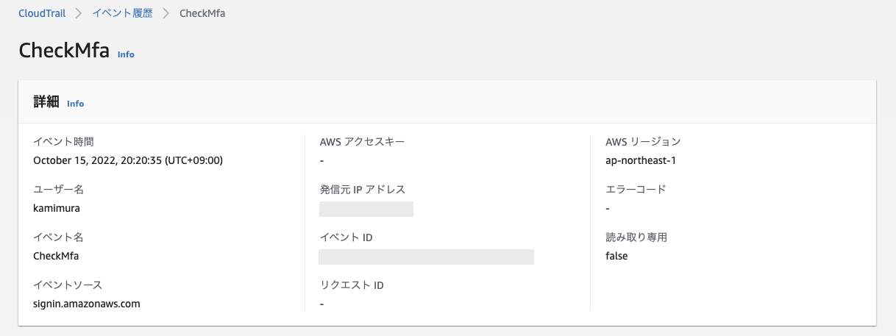
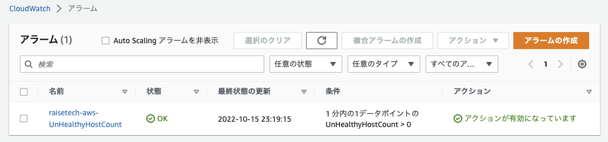
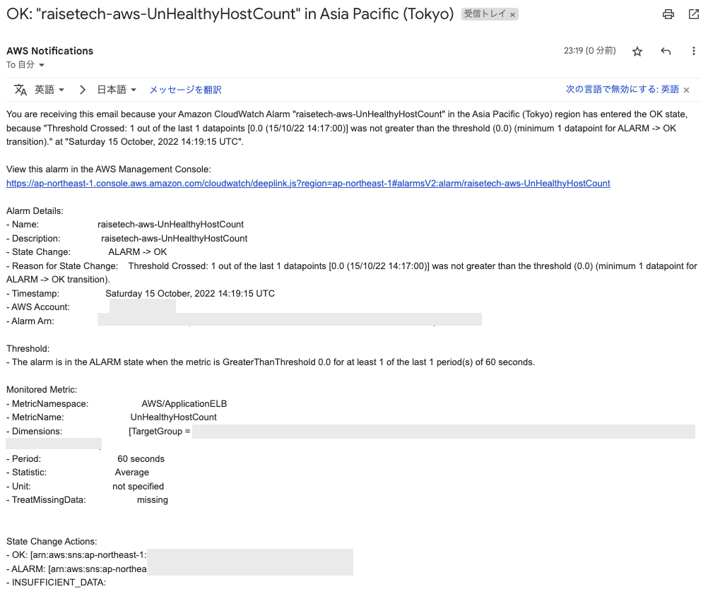
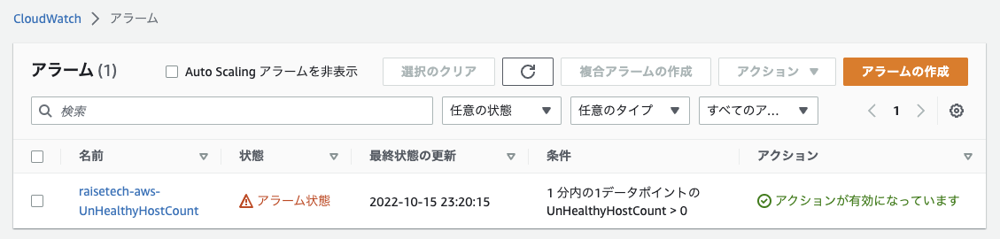
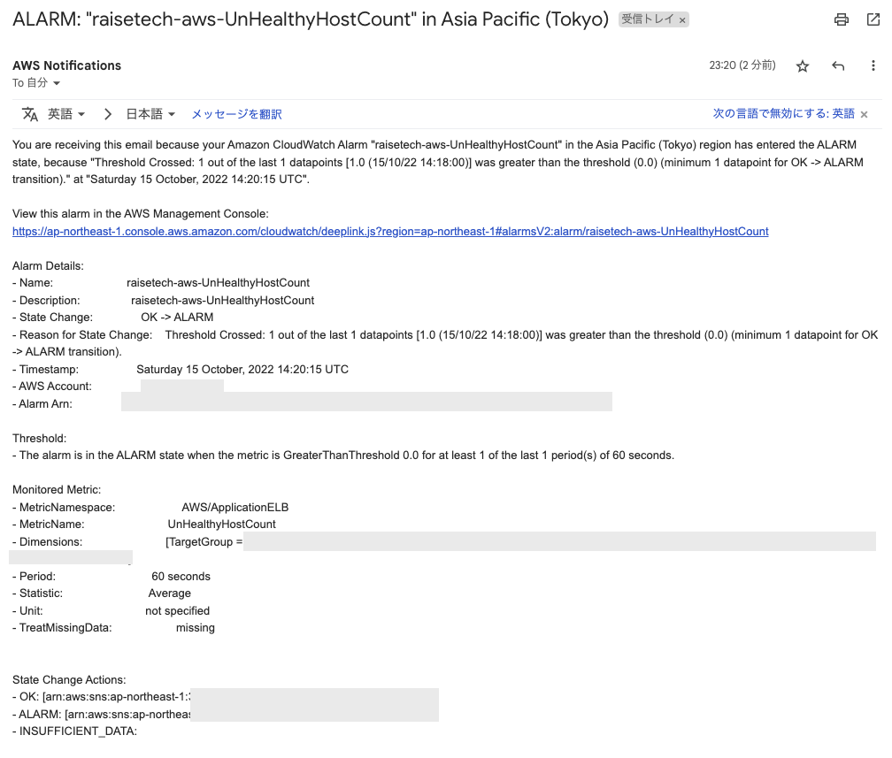
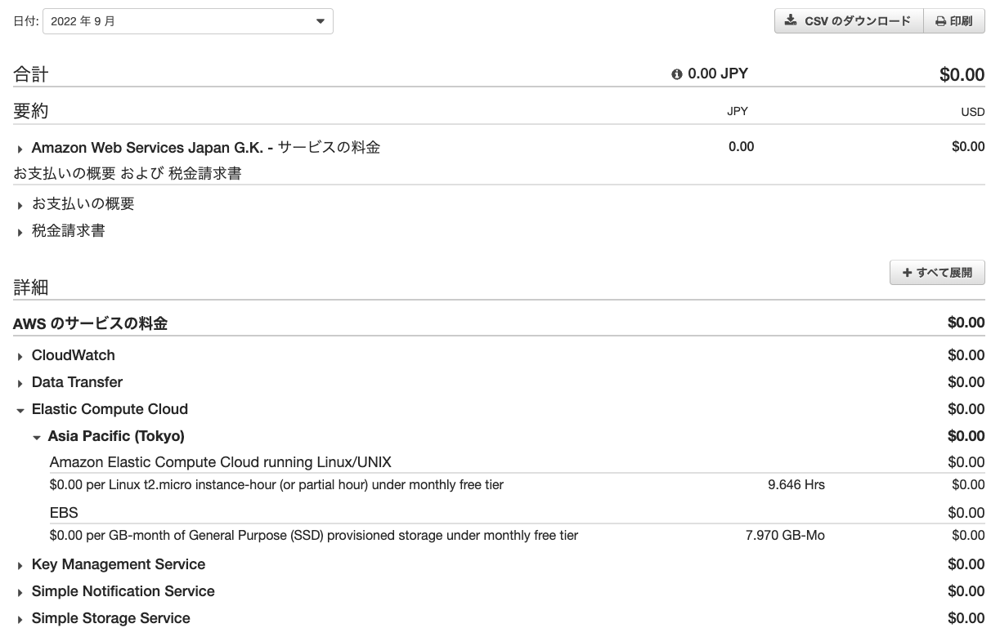
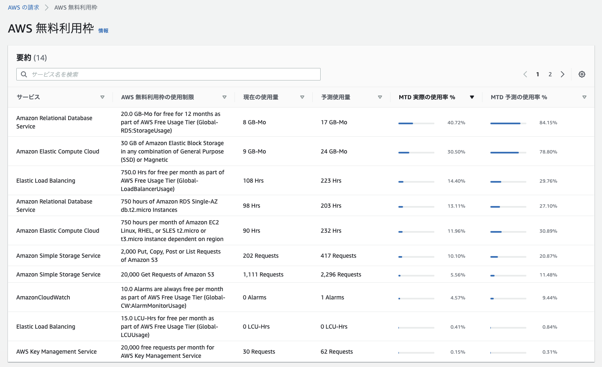

# AWSフルコース（22年9月度）第６回課題
## 課題
- 最後に AWS を利用した日の CloudTrail のイベントをピックアップする。
	- ご自身の IAM ユーザー名があるものでOK。
	- イベント名と、イベントに含まれている内容 3つ をピックアップする。
- CloudWatch アラームを使って、ALB のアラームを設定して、メール通知する。
	- メールには Amazon SNS を使う。アラーム と OKアクション を設定して、動作確認する。
- AWS 利用料の見積を作成する。
	- 今日までに作成したリソースの内容を見積もり、URL を共有する。
- マネジメントコンソールから、現在の利用料を確認する。
	- 先月の請求情報から、EC2 の料金がいくらか確認する。

## 1. CloudTrail
AWSにIAMユーザーでMFAログインした時のログです。  

- ［イベント名］CheckMfa
- 含まれる内容３つ
	- イベント発生時間
	- ユーザー名
	- 発信元IPアドレス

## 2. CloudWatchアラーム
#### 2-1. CloudWatchアラームを作成
- CloudWatchダッシュボードから、［アラームの状態］-［アラームの作成］をクリック
- ［メトリクスの選択］-［ApplicationELB］-［UnHealthyHostCount］を選択。
- 条件：0 より大きい
- 通知
	- ［アラーム状態］
	- ［通知の追加］-［OK］

#### 2-2. アラートの確認
- **Nginx + Unicorn 起動時**
	- **ステータス画面**

	- **サーバー起動後に登録SNSに届いたメッセージ**

- **Nginx + Unicorn 停止時**
	- **ステータス画面**

	- **サーバー停止後に登録SNSに届いたメッセージ**

## 3. AWS利用料見積もり
第５回課題までの構成での見積もりです。  
[https://calculator.aws/#/estimate?id=976c144c6e7549a4c18ec927c832e34ab1c2494d](https://calculator.aws/#/estimate?id=976c144c6e7549a4c18ec927c832e34ab1c2494d)

## 4. 請求額
- 9月のAWS利用請求額とEC2の利用状況です。無料利用枠内に収まっています。

- 無料利用枠の使用状況です。思いの外、RDSを使用していて驚きました。  
８GBも使用した覚えがないのですが、スナップショットがかなり容量を食うと見かけたので、この８GBもほとんどがスナップショットなのかなぁと考えています。

