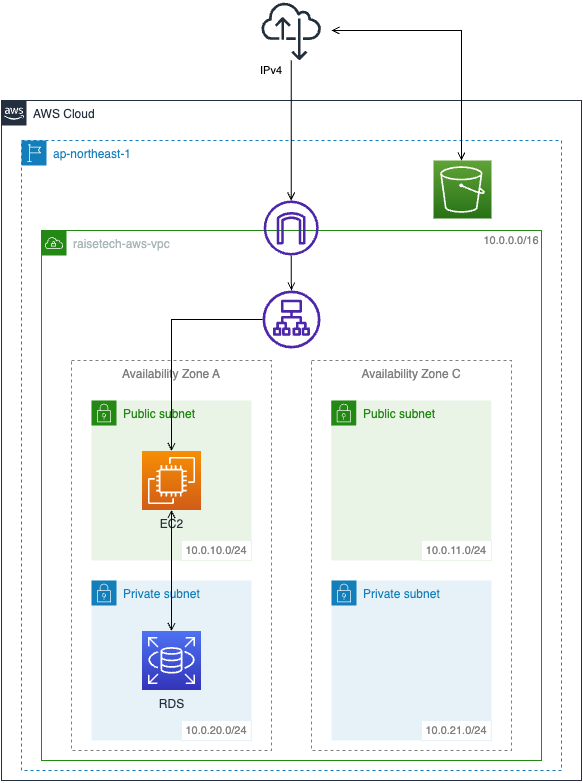
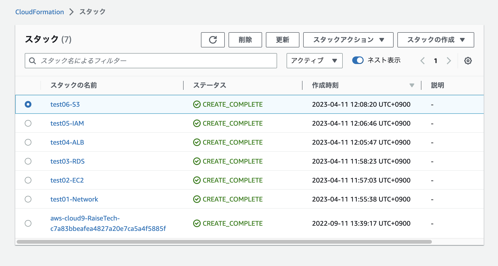

# AWSフルコース 第１０回課題
## 課題
- CloudFormation を利用して、現在までに作った環境をコード化する。
- コード化ができたら実行してみて、環境が自動で作られることを確認する。

## 1. CloudFormationでこれまでの環境をコード化
#### 1-1. ネットワークの作成
1-1-1. VPCを作成する。  
1-1-2. サブネットを作成する。（パブリックサブネット２種、プライベートサブネット２種）  
1-1-3. ルーティングを設定する  
-　インターネットゲートウェイを作成し、VPCにアタッチする。
-　ルートテーブルを作成し、IGWとパブリックサブネットへのルーティングを設定する。

#### 1-2. EC2の作成
1-2-1. EC2用のキーペアを作成する。  
1-2-2. EC2インスタンスをパブリックサブネットに成する。  
1-2-3. EC2用のセキュリティグループを作成し、HTTP（80）、SSH（22）、rails（3000）からのアクセスを許可する。

#### 1-3. RDSの作成
1-3-1. RDSをプライベートサブネットに作成する。  
1-3-2. RDS用のセキュリティグループを作成し、EC2のMySQL（3306）からのアクセスを許可する。  
1-3-3. RDS用のサブネットグループを作成し、プライベートサブネット２種を指定する。  
1-3-4. RDS用のパラメータグループを作成し、MySQL8.0を指定する。  
1-3-5. RDS用のオプショングループを作成する。

#### 1-4. ALBの作成
1-4-1. ALBを作成する。  
1-4-2. ALB用のセキュリティグループを作成し、HTTP（80）からのアクセスを許可する。  
1-4-3. ターゲットグループを作成し、EC2をターゲット登録する。  
1-4-4. リスナーを作成する。

#### 1-5. IAMの作成
1-5-1. railsアプリ用にS3へのフルアクセス権限を持つIAMユーザーを作成する。  
1-5-2. IAMのアクセスキーを発行し、SecretManagerに格納する。（[参考](https://dev.classmethod.jp/articles/issuing-iam-access-keys-and-storing-them-in-secrets-manager-with-cloudformation/)）

#### 1-6. S3の作成
1-6-1. パブリックアクセス可能なS3を作成する。  
1-6-2. バケットポリシーを作成し、rails用IAMユーザーからのみアクセスを許可する。

### （補足）構成図

## 2. コードの動作確認

