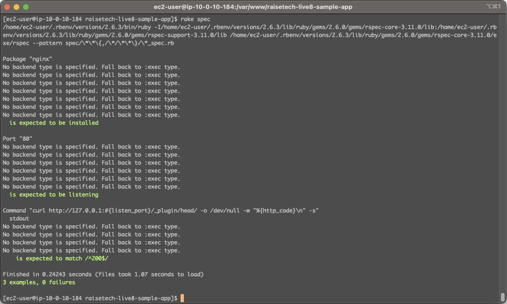
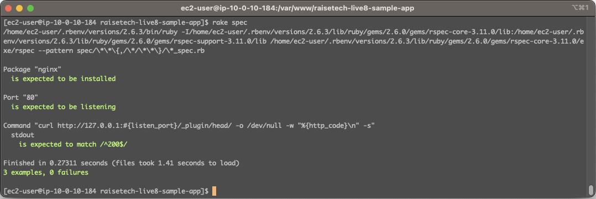
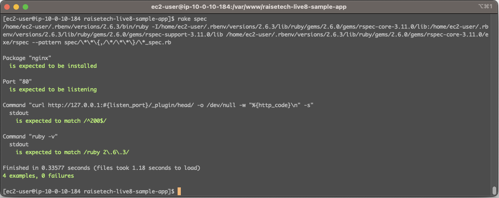
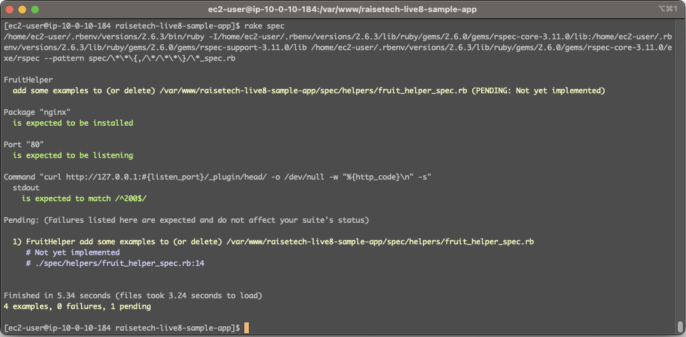

# AWSフルコース 第１１回課題
## 課題
- [課題用サンプル](https://github.com/MasatoshiMizumoto/raisetech_documents/tree/main/aws/samples/serverspec)のServerSpecのテストが成功するか確認する。
- テストをカスタマイズしてみる。

## 1. ServerSpecをEC2にインストールする。
- （[参考１](https://note.com/kinako1525/n/n631440d86ac4)、[参考２](https://serverspec.org/)）

- ターミナルからEC2にログインして、ディレクトリを移動`cd raisetech-live8-sample-app`
- Gemfileに`gem 'serverspec'`を追記する。
- `bundle install`
- `serverspec-init`  

「1) UN*X」と「2) Exec (local)」を選ぶ。
```
Select OS type:

  1) UN*X
  2) Windows

Select number: 1

Select a backend type:

  1) SSH
  2) Exec (local)

Select number: 2

 + spec/localhost/
 + spec/localhost/sample_spec.rb
!! spec/spec_helper.rb already exists and differs from template
!! Rakefile already exists and differs from template
 + .rspec
```
- `vim spec/localhost/sample_spec.rb`で、テストコードの内容を課題用サンプルのものに書き換える。  
（※ listen_portは80に書き換える。）


## 2. ServerSpecのテストを実行する。
- テストを実行する。`rake spec`
- 無事成功
- ただし、`No backend type is specified. Fall back to :exec type.`というエラーが沢山出てくる。

- テストコードの2行目に`set :backend, :exec`を書き足す。([参考](https://qiita.com/ikuwow/items/abdce2b4118f07241bc8)）
- エラーが消えてテスト成功。



## 3. テストをカスタマイズしてみる。
- テストを追加してみる。（[参考](https://qiita.com/oh_4shiki/items/9439249781b5557a19b6)）
```
# コマンドの標準出力から指定のバージョンがインストールされているか確認する
describe command('ruby -v') do
  its(:stdout) { should match /ruby 2\.6\.3/ }
end
```
- 無事成功


## 4. 遭遇したエラー
- テスト結果に`PENDING: Not yet implemented`が出ていた。fruit_helper_spec.rbの該当箇所をコメントアウトしたらを解消した。fruit_helper_spec.rbはrspecインストール時に自動生成されるらしい。（[参考１](https://qiita.com/_kanacan_/items/59d05a605ef3ed992b03)、[参考２](https://blog.willnet.in/entry/2014/06/10/142341)）

- ServerSpecインストール時に`bundle install`だとKilledになるので、`gem install serverspec`でインストールしたところ、rspecがインストールされておらずテストコードが実行できないエラーが出続けて困った。
（```NoMethodError: undefined method `package' for main:Object```が出る。）何度もKilledになりつつ`bundle install`を挑戦し続けたら、最終的にrspecがインストールでき、エラー原因が判明。