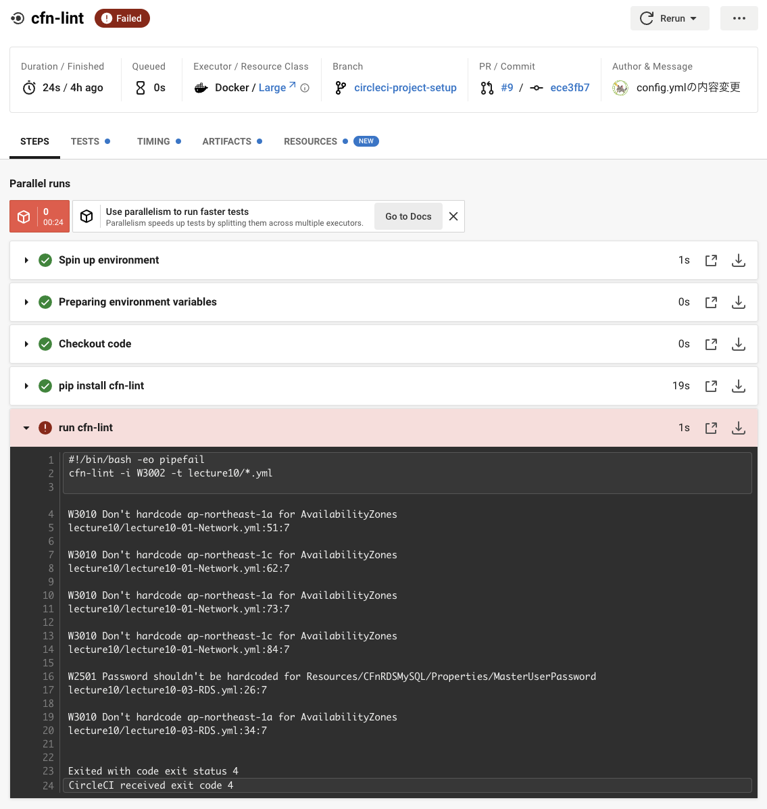
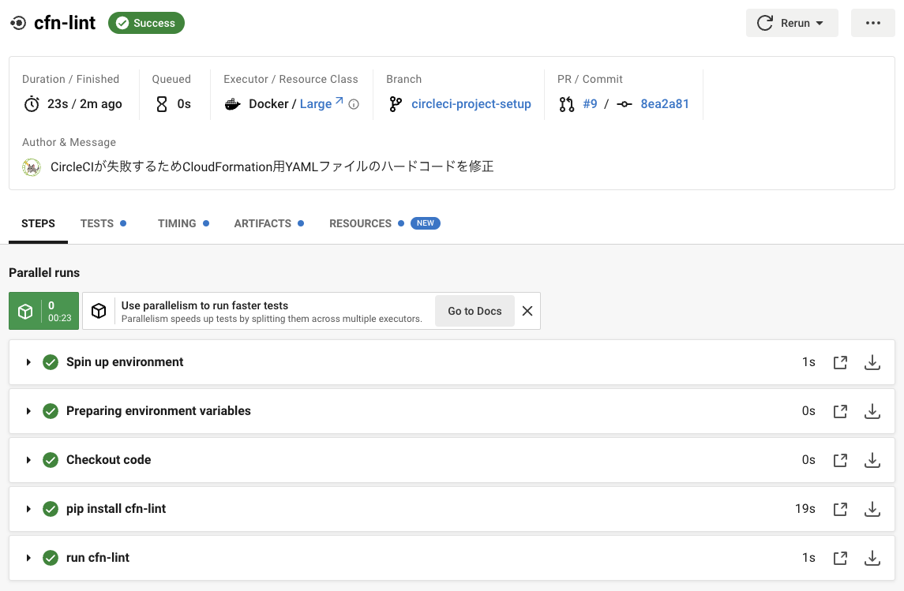

# AWSフルコース 第１２回課題
## 課題
- 課題用に提供されたCircleCIのサンプルコンフィグを自身のリポジトリに組み込み、正常に動作するか確認する。

## 1. リポジトリにCircleCIを導入する。
- [公式ドキュメント](https://circleci.com/docs/ja/getting-started/)に従い、Github上の自分の作業リポジトリにCicleCIを導入する。
- “circle-ci-setup” という名前の新規ブランチに .circleci/config.yml ファイルが作成される。

#### 2. 新規ブランチをローカル環境に取り込む
- `git fetch`でローカル環境ブランチをリモート（orogin/master）と同じ状態にする。
- `git branch -a`で取り込めたか確認。
- `git checkout -b circleci-project-setup origin/circleci-project-setup`でローカルに同名のブランチを作成する。
- `git merge origin/circleci-project-setup`でリモートブランチの内容をローカルブランチにマージする。
- `ls -a`で.circle ciフォルダをpullできているか確認する。
- （[参考](https://midorigame-jo.com/git-fetch-branch/)）

#### 3. .circleci/config.ymlファイルの内容をサンプルコードに書き換える。
- 内容を[サンプルコード](https://github.com/MasatoshiMizumoto/raisetech_documents/blob/ffdf040535f6affd2195658aa985242bab41ed51/aws/samples/circleci/config.yml)に書き換える。  

```
# 13行目のディレクトリを自分の環境に合わせて変更する。

cfn-lint -i W3002 -t lecture10/*.yml
```

#### 4. git pushしてCircleCIの動作を確認する。
- `git push Origin circle-ci-setup`
- 失敗

- AZをハードコードしていると怒られたので、lecture10-01-Network.ymlとlecture10-03-RDS.ymlの該当箇所を修正。（[参考](https://chamimi.blog.jp/archives/15549977.html)）
- lecture10-03-RDS.ymlのパスワードのハードコードを修正し、NoEcho属性をTrueで追記。（[参考](https://qiita.com/Mouflon_127000/items/97e1e4b10a18871d8609#noecho%E5%B1%9E%E6%80%A7)）
- CloudFormationで動作確認後、再度`git push Origin circle-ci-setup`
- 成功

