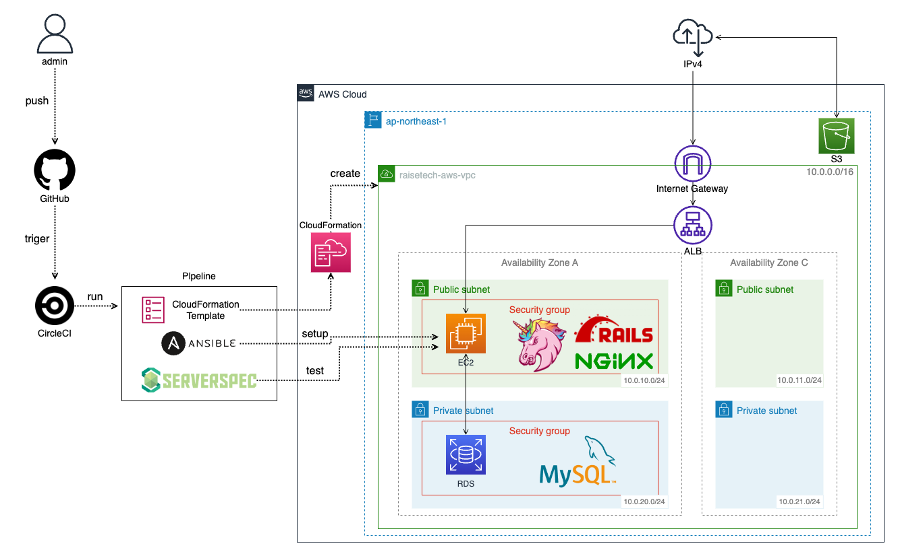
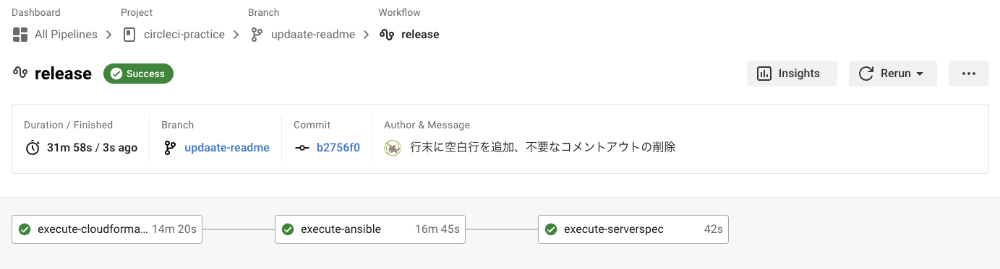
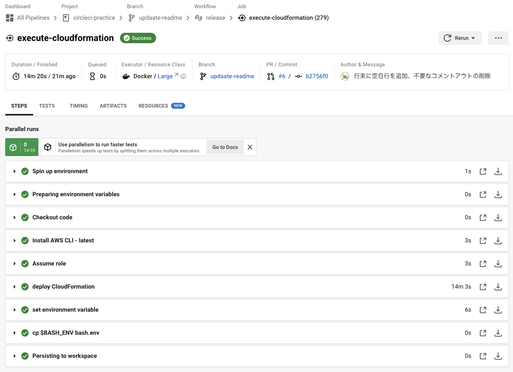
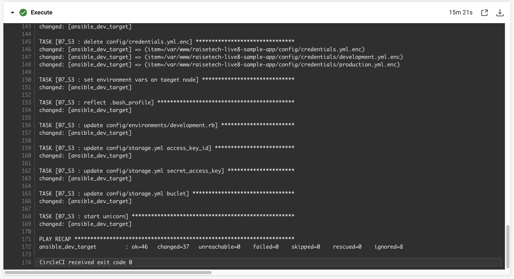
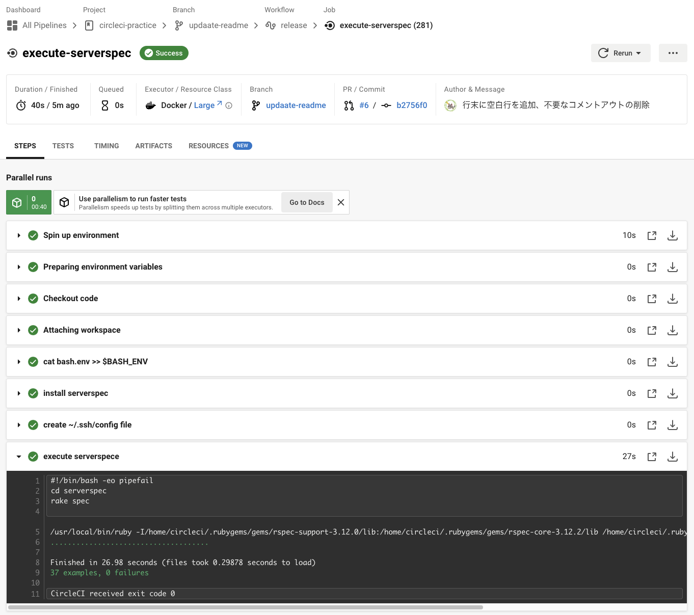
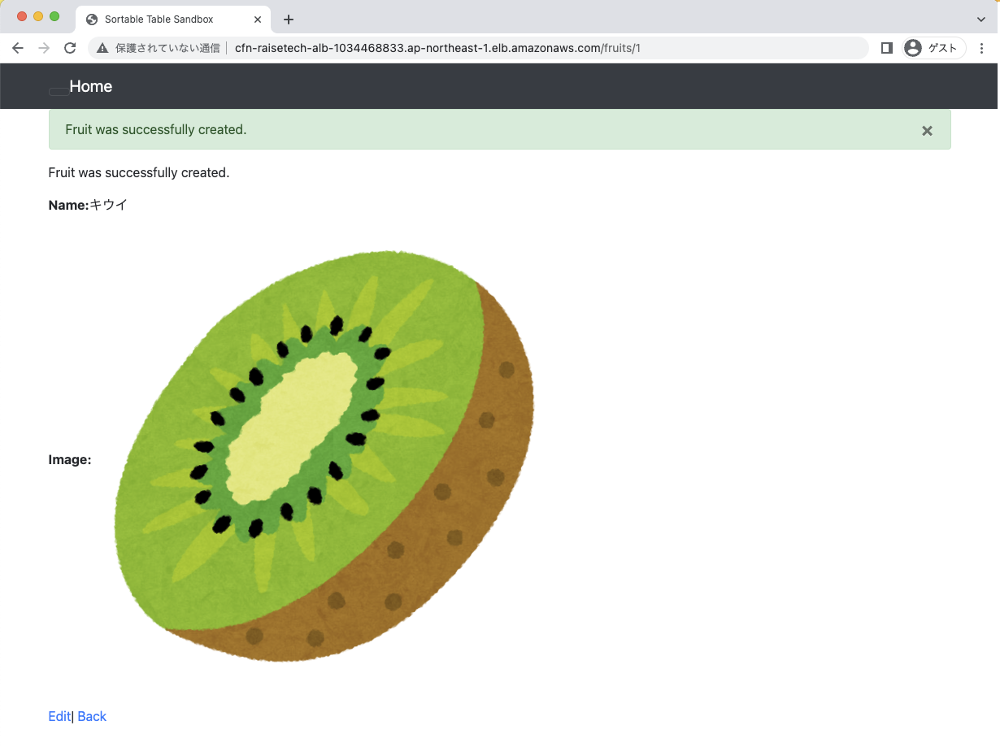
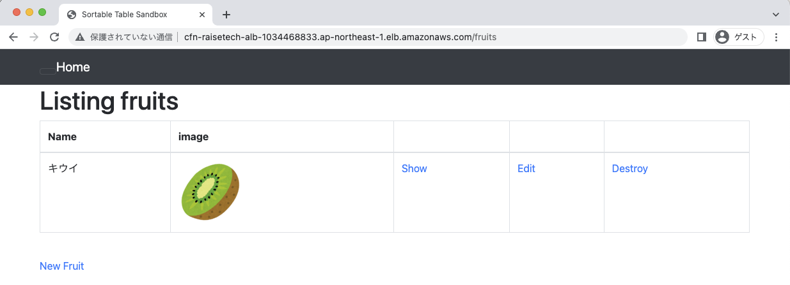
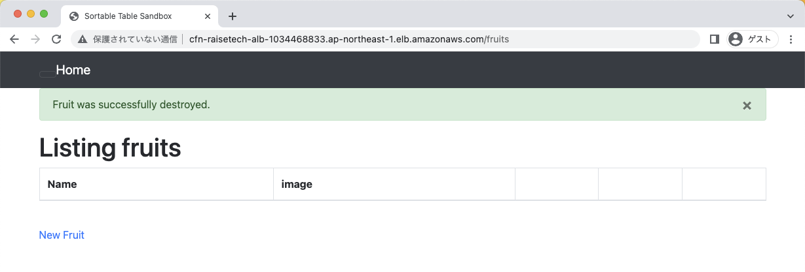
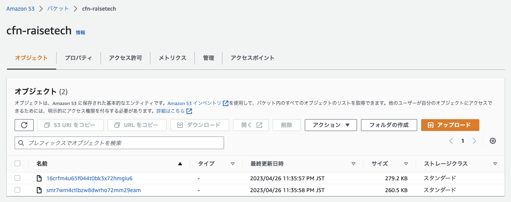

# AWSフルコース 第１３回課題（最終課題）CloudFormationバージョン
## 概要
- CloudFormationによるインフラ構築
- Ansibleによるサーバー環境構築とアプリのデプロイ
- Serverspecによるインフラテスト
- 上記をGItHubへのpushをトリガーにCircleCIで、CloudFormation → Ansible → Serverspecを自動でおこなう。

## 構成図

## 補足
- CloudFormationは[第１０回課題](https://github.com/mkmmr/aws-practice/tree/main/lecture10)で作成済みのものを使用しています。
- デプロイ用のアプリは課題用に提供されている[サンプルアプリ](https://github.com/yuta-ushijima/raisetech-live8-sample-app)を使用しています。
- この記事のコードは[こちらのリポジトリ](https://github.com/mkmmr/circleci-practice)をご参照ください。
- 同じ内容で[Terraformバージョン](https://github.com/mkmmr/terraform-practice)も作成しました。

## 実装手順
コードや実装手順の詳細は[こちらのリポジトリ](https://github.com/mkmmr/circleci-practice)をご参照ください。

1. Ansble 実装手順
    - ローカルPCにAnsbleをインストール
    - ローカルPCにSSH接続用キーを準備
    - AnsibleからEC2インスタンスに接続
    - playbook.ymlにサーバー環境構築とアプリのデプロイについて記述
    - Ansibleで遭遇したエラー
2. CircleCI 実装手順
    - CircleCIとAWSをOIDC連携
    - CircleCIにCloudFormationを実装
    - CircleCIにAnsibleを実装
3. Serverspec 実装手順
    - CircleCIにServerspecを実装
    - ServerspecからEC2にSSH接続
    - Serverspecテストの実装
    - Serverspecで遭遇したエラー

## 成功画面
### ◆ CircleCI成功画面

### ◆ CloudFormation成功画面

### ◆ Ansible成功画面

### ◆ Serverspec成功画面

[\[↑ 上へ\]](#awsフルコース-第１３回課題最終課題CloudFormationバージョン)

## アプリの正常動作確認
### ◆ New Fruit Saveした時

### ◆ 新規追加後の一覧画面

### ◆ Destroyした時

[\[↑ 上へ\]](#awsフルコース-第１３回課題最終課題CloudFormationバージョン)

## S3への画像登録確認

[\[↑ 上へ\]](#awsフルコース-第１３回課題最終課題CloudFormationバージョン)
