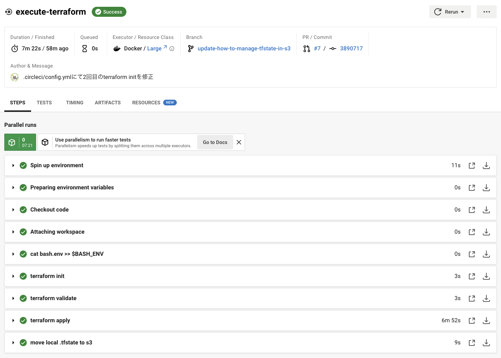
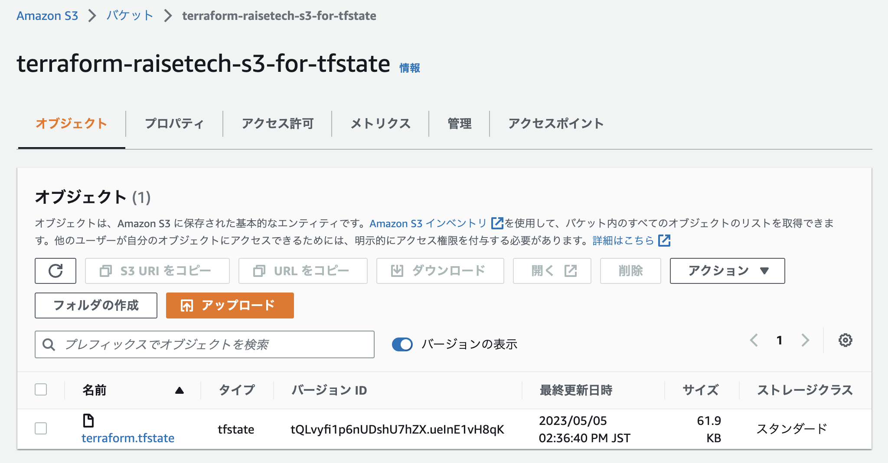
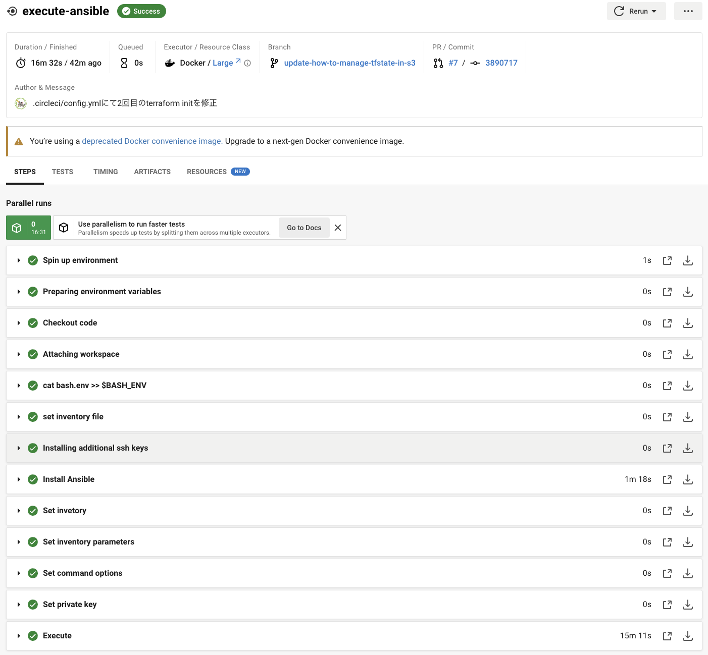

# AWSフルコース 第１３回課題（最終課題）Terraformバージョン
## 概要
- Terraformによるインフラ構築
- Ansibleによるサーバー環境構築とアプリのデプロイ
- Serverspecによるインフラテスト
- 上記をGItHubへのpushをトリガーにCircleCIで、Terraform → Ansible → Serverspecの実装を自動でおこなう。

## 構成図

## 補足
- Terraformの内容は[第１０回課題](https://github.com/mkmmr/aws-practice/tree/main/lecture10)で作成したCloudFormationと同じです。
- デプロイ用のアプリは課題用に提供されている[サンプルアプリ](https://github.com/yuta-ushijima/raisetech-live8-sample-app)を使用しています。
- この記事のコードは[こちらのリポジトリ](https://github.com/mkmmr/terraform-practice)をご参照ください。
- 同じ内容で[CloudFormationバージョン](https://github.com/mkmmr/circleci-practice)も作成しています。
- AnsibleとServerspecはCloudFormationバージョンと同じものを使用しているため、手順から割愛しています。詳しくは[CloudFormationバージョン](https://github.com/mkmmr/circleci-practice)をご参照ください。

## 実装手順
コードや実装手順の詳細は[こちらのリポジトリ](https://github.com/mkmmr/terraform-practice)をご参照ください。

1. Terraform 実装手順
    - ローカルPCにTerraformをインストール
    - TerrafromでIAM用SecretAccessKeyの発行
    - Terraformで遭遇したエラー
2. CircleCIへのTerraform実装手順
    - 準備
    - CircleCIにTerraformを実装
    - tfstateファイルをS3バケットで管理する
    - CircleCIで遭遇したエラー

[\[↑ 上へ\]](#awsフルコース-第１３回課題最終課題Terraformバージョン)

## 成功画面
### ◆ CircleCI成功画面

### ◆ Terraform成功画面

### .tfstateの管理をS3に変更成功

### ◆ Ansible成功画面

### ◆ Serverspec成功画面

[\[↑ 上へ\]](#awsフルコース-第１３回課題最終課題Terraformバージョン)

## アプリの正常動作確認
### New Fruit Saveした時

### 新規追加後の一覧画面

### Destroyした時

[\[↑ 上へ\]](#awsフルコース-第１３回課題最終課題Terraformバージョン)

## S3への画像登録確認

[\[↑ 上へ\]](#awsフルコース-第１３回課題最終課題Terraformバージョン)

## 感想
- AssumeRoleを使う場合、一度CircleCIを止めると`$ terraform destroy`が使えないため、手動でリソースを削除しなければならず大変不便であり、誤って他のリソースを消す危険性がある。また、消し忘れるとその度にCIが止まるので作業効率が非常に悪い。RDSの削除にも時間がかかる。Terraformを使用する場合、開発時はAssumeRoleではなく、通常のIAMユーザを使用した方が良い。
- TerraformでIAMを作成しようとすると、AccessKey作成にgpgのペアキーが必要であり、実装が手間。
- 運用方法によってはCloudFormationの方が使い勝手が良いと感じた。

[\[↑ 上へ\]](#awsフルコース-第１３回課題最終課題Terraformバージョン)
