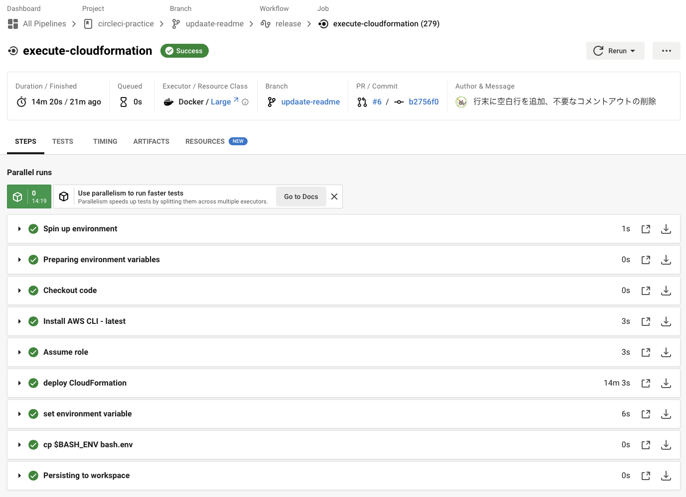
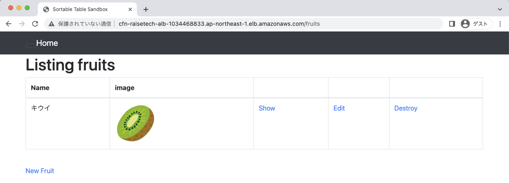

# AWSフルコース 第１３回課題（最終課題）
## 概要
- CircleCIで、CloudFormation → Ansible → Serverspecを自動でおこなう。
- 実装手順
    - ローカルPCをAnsibleの管理サーバにしてPlaybookを作成。
    - CircleCIでCloudFormationを実行できるようにする。
    - CircleCIをAnsibleの管理サーバにする。
    - Serverspecの実装
- 補足
    - CloudFormationは[第１０回課題](https://github.com/mkmmr/aws-practice/tree/main/lecture10)で作成済みのものを使用
    - デプロイ用のアプリは課題用に提供されている[サンプルアプリ](https://github.com/yuta-ushijima/raisetech-live8-sample-app)を使用

## 目次
- [1. Ansble 実装手順](#1-Ansble-実装手順)
    - [1-1. ローカルPCにAnsbleをインストール](#1-1-ローカルPCにAnsbleをインストール)
    - [1-2. ローカルPCにSSH接続用キーを準備](#1-2-ローカルPCにSSH接続用キーを準備)
    - [1-3. AnsibleからEC2インスタンスに接続](#1-3-AnsibleからEC2インスタンスに接続)
    - [1-4. playbook.ymlにサーバー環境構築とアプリのデプロイについて記述](#1-4-playbook.ymlにサーバー環境構築とアプリのデプロイについて記述)
    - [1-5. Ansibleで遭遇したエラー](#1-5-Ansibleで遭遇したエラー)
- [2. CircleCI 実装手順](#2-CircleCI-実装手順)  
    - [2-1. CircleCIとAWSをOIDC連携](#2-1-CircleCIとAWSをOIDC連携)
    - [2-2. CircleCIにCloudFormationを実装](#2-2-CircleCIにCloudFormationを実装)
    - [2-3. CircleCIにAnsibleを実装](#2-3-CircleCIにAnsibleを実装)
- [3. Serverspec 実装手順](#3-Serverspec-実装手順)
    - [3-1. CircleCIにServerspecを実装](#3-1-CircleCIにServerspecを実装)
    - [3-2. ServerspecからEC2にSSH接続](#3-2-ServerspecからEC2にSSH接続)
    - [3-3. Serverspecテストの実装](#3-3-Serverspecテストの実装)
    - [3-4. Serverspecで遭遇したエラー](#3-4-Serverspecで遭遇したエラー)
- [4. 成功画面](#成功画面)
    - [4-1. CircleCI成功画面](#4-1-CircleCI成功画面)
    - [4-2. アプリの正常動作確認](#4-2-アプリの正常動作確認)
    - [4-3. S3に画像登録確認](#4-3-S3に画像登録確認)
- [5. 構成図](#5-構成図)


## 1. Ansble 実装手順
- 最初は自分のPCを管理サーバにして動作確認し、その後CircleCIに移行した。
### 1-1. ローカルPCにAnsbleをインストール
- Ansibleをインストールする。`$ brew install ansible`

（参考）[ansible | Homebrew Formulae](https://formulae.brew.sh/formula/ansible)

### 1-2. ローカルPCにSSH接続用キーを準備
- AWSコンソールでEC2のキーペアを作成する。
- ダウンロードした.pemファイルを.shhフォルダに移動する。
- アクセス権限を変更 `$ sudo chmod 0600 キーの名前.pem`

### 1-3. AnsibleからEC2インスタンスに接続
- ansibleフォルダを作成し、その中にinventoryファイル、playbook.ymlファイルを作成する。
- inventoryにEC2への接続情報を書く。
```
[target_node]
ansible_dev_target ansible_host=EC2のパブリックIPアドレス

[target_node:vars]
ansible_connection=ssh
ansible_user=ec2-user
ansible_ssh_private_key_file="~/.ssh/キーの名前.pem"
```
- ansibleフォルダのあるディレクトリに移動し、接続確認する。
```
$ ansible -i inventory target_node -m ping
```

### 1-4. playbook.ymlにサーバー環境構築とアプリのデプロイについて記述
#### 1-4-1. Ansibleで気をつけること
- Ansibleでcommandモジュールとshellモジュールを使うと必ず実行され冪等性が確保できないため、使う時はできるだけ条件を付けるようにする。（インストールされていない時に実行する等）
    - （参考）[Ansibleでシェルコマンドを実行させるときのノウハウ - Qiita](https://qiita.com/chroju/items/ec2f7bb87d9ae3603c6a)
    - （参考）[【Ansible】rbenv でインストールした gem を使って bundler をインストールするコツ](https://oki2a24.com/2017/05/12/how-to-use-gem-installed-with-rbenv-in-ansible/)
- shellモジュール実行時、`.bash_profile`の設定が読み込まれないため、bundlerやgemを使う時は`bash -lc`を付けてログインシェルとして実行する。
    - （参考）[ansibleでshellモジュール実行時に環境変数(.bash_profile)が反映されない問題](https://www.bunkei-programmer.net/entry/2015/05/16/162020)
- 変数を書く場所がたくさんあるので、用途と優先順位に合わせて使用する。
    - （参考）[変数の使用 | Ansible Documentation](https://docs.ansible.com/ansible/2.9_ja/user_guide/playbooks_variables.html?highlight=variable%20precedence)
    - （参考）[Ansible 変数の優先順位と書き方をまとめてみた - Qiita](https://qiita.com/answer_d/items/b8a87aff8762527fb319)
- Ansible操作コマンド
    - ドライラン `$ ansible-playbook -i inventory playbook.yml --check`
    - 実行（`-vvv`を付けるとエラーの詳細を確認できる） `$ ansible-playbook -i inventory playbook.yml -vvv`

#### 1-4-2. 作成するPlaybook一覧

1. 必要なパッケージのインストール
2. Rubyのインストール
3. Githubからアプリをクローン・Bundlerでの必要なライブラリのインストール
4. MySQLのインストール・RDSへの接続・DBの作成
5. Nginxのインストール・設定
6. unicornのインストール・設定
7. S3と接続

#### 1-4-3. 第５回課題と異なる箇所
- 基本的な構成は[第５回課題](https://github.com/mkmmr/aws-practice/blob/3fd540a260a9be43654f5faab9bc3103f494a1e1/lecture05.md)と同じ。
- ここでは第５回課題と異なる箇所について記載する。

##### ◆ MySQLのダウンロードに以前の方法が使えなくなっていたため、新しいMySQL GPGキーをインポートする。
```
＜以前の方法＞ 22.10月時点
sudo yum localinstall -y https://dev.mysql.com/get/mysql80-community-release-el7-7.noarch.rpm

＜新しい方法＞　23.4月時点
sudo rpm --import https://repo.mysql.com/RPM-GPG-KEY-mysql-2022
sudo rpm -Uvh https://dev.mysql.com/get/mysql80-community-release-el7-7.noarch.rpm
sudo yum install -y mysql-community-devel mysql-community-server
```
（参考）[Amazon Linux2 に MySQL をインストールしようとしたら Nothing to do となった | Serverworks](https://blog.serverworks.co.jp/I-tried-to-install-MySQL-on-Amazon-Linux2-and-got-Nothing-to-do#%E5%9B%9E%E9%81%BF%E7%AD%96-%E6%96%B0%E3%81%97%E3%81%84-MySQL-GPG-%E3%82%AD%E3%83%BC%E3%82%92%E3%82%A4%E3%83%B3%E3%83%9D%E3%83%BC%E3%83%88%E3%81%99%E3%82%8B)

##### ◆ Node.js最新版18.x系はAmazonLinuxでは使えないため16.x系をインストールする。

（参考）[【AmazonLinux2】EC2のサーバにNodeJS18をセットアップする](https://itneko.com/amazon-linux2-nodejs18/)

##### ◆ Webpackerは使用しない（アプリで使用するrailsのバージョンが6から7に変更になったため）

##### ◆ エラー`Rails Sprockets::Rails::Helper::AssetNotFound`が出るため、以下でアセットをcleanする。
```
bundle exec rake assets:clean
bundle exec rake assets:precompile
```

（参考）[Rails Sprockets::Rails::Helper::AssetNotFound の解決に色々頑張った話 - Qiita](https://qiita.com/Akane-Toribe/items/77956c7149acc734dcba)

##### ◆ ALB利用時、blocked host error回避のため、config/environments/development.rbにALBエンドポイントを記載する。

##### ◆ S3接続用のAcceessKeyを、credentials.yml.encではなくEC2のローカルに環境変数として格納する。
- Ansibleで`EDITOR="vi" bin/rails credentials:edit`しようとすると、どうもvimから抜け出せなくなってansibleが止まるっぽい。
- credentials.yml.encを残したままrailsからEC2のローカル環境変数を呼び出そうとしても、呼び出せない。（credentials.yml.encが優先される？）
- credentials.yml.enc、development.yml.enc、production.yml.encを削除すると、EC2のローカル環境変数を呼び出せるように。

##### ◆ unicornの起動はconfig/storage.yml変更後にする。

##### ◆ 今回CORSルールの設定をしなくてもS3に画像をアップロードできたので設定せず。原因不明。

<details>
<summary><h3>1-5. Ansibleで遭遇したエラー</h3></summary>

- Node.jsやyarnが操作権限周りでインストールできない。 → `become_user: root`で可能に。
- `user_install=no`  
（参考）[Ansibleのgemモジュールはuser_installがデフォルトになっている - HatenaBlog](https://chulip.org/entry/2016/09/20/134402)
- cssが反映されない……と困っていたら/etc/nginx/conf.d/raisetech-live8-sample-app.confで余計な設定してたせいだった。消したら見られるようになった。

（/etc/nginx/conf.d/raisetech-live8-sample-app.conf）
```
# 以下を削除
  # assetsファイル(CSSやJavaScriptのファイルなど)にアクセスが来た際に適用される設定
  location ^~ /assets/ {
    gzip_static on;
    expires max;
    add_header Cache-Control public;
  }
```

- アプリのクローン先を`/home/ec2-user/var/www/raisetech-live8-sample-app`にすると、どうしてもNginxからUnicornに接続できなかった。/etc/nginx/conf.d/raisetech-live8-sample-app.conf、config/unicorn.rbいずれのソケットもディレクト先にあわせて変更済み。
アプリのクローン先を`/var/www/raisetech-live8-sample-app`にしたら接続できた。原因不明。

##### （おまけ）アプリに関するエラー：railsコンソールでconfig/credentials.yml.encの内容が読めない。  
- config/master.keyとconfig/credentials.yml.encを作り直す。 → だめ
- `rails c`で確認すると、読み込めていない。
```
$ rails c

irb(main):001:0> Rails.application.credentials.aws[:access_key_id]
(irb):1:in `<main>': undefined method `[]' for nil:NilClass (NoMethodError)
```

（参考）  
[Rails credentials returning nil | GO RAILS](https://gorails.com/forum/rails-credentials-returning-nil)  
[NoMethodError - undefined method '[]' for nil:NilClass: - Github](https://github.com/rails/rails/issues/40763)  
[Rails credentials returning nil](https://stackoverflow.com/questions/55128266/rails-credentials-returning-nil)

- ローカルの環境パスにRAILS_MASTER_KEYを設定して呼び出してみる。  
→ だめ  
→ この状態だとcredentials.yml.encとmaster.keyが不一致で、railsを起動できなくなる。
```
$ sudo vim /etc/environment
RAILS_MASTER_KEY='b1442dbd4e494e58ec6634627cea3d74'

$ env | grep RAILS_MASTER_KEY
`rescue in _decrypt': ActiveSupport::MessageEncryptor::InvalidMessage`
```

- config/credentials.yml.encは環境ごとに作れるらしい……？  
試してみるためにdevelopment.yml.enc消す。→ 急にcredentials.yml.encが読み込めるように！  
（どうやらconfig/credentials.yml.encよりdevelopment.yml.encが優先されるらしい。）

（参考）  
[Rails 6よりサポートされたMulti Environment Credentialsをプロジェクトに導入する - Zenn](https://zenn.dev/banrih/articles/f22f0a70bbead2a02110)  
[Rails 6 adds support for multi environment credentials](https://blog.saeloun.com/2019/10/10/rails-6-adds-support-for-multi-environment-credentials.html)

- でもAnsibleで`EDITOR="vi" bin/rails credentials:edit`しようとすると、どうもvimから抜け出せなくなるって止まるようなので、結局諦めてS3へのAccessKeyはEC2のローカルに環境変数として格納することに。

</details>

<p style="text-align: right"><a name="目次">[↑ 目次へ]</a></p>

## 2. CircleCI 実装手順
### 2-1. CircleCIとAWSをOICD連携
CircleCI用の長期的なAWSアクセスキーは発行せず、OICD連携してSTSから一時クレデンシャルを発行することで、CircleCIはIAMロールの権限を一時的に引き受けることができる。（Assume Role）

#### 2-1-1. OICD連携 手順
- CircleCIの組織IDとプロジェクトIDを確認する。
- AWSのIDプロバイダにCircleCIを追加する。
- CircleCIで使用するAssumeRole用のIAMロールを作成する。
- IAMロールにカスタム信頼ポリシーを設定して、特定のCircleCIプロジェクトからのみ認証を許可するようにする。
- CircleCIのOrganization SettingsでAWS用のContextを作成し、環境変数として`AWS_IAM_ROLE_ARN`と`AWS_REGION`を登録する。
- .circleci/config.ymlのjobにAssumeRoleを可能にするコードを追加する。

（.circleci/config.yml）
```
      - run:
          name: Assume role
          command: |
            aws_sts_credentials=$(aws sts assume-role-with-web-identity \
              --role-arn ${AWS_IAM_ROLE_ARN} \
              --web-identity-token ${CIRCLE_OIDC_TOKEN} \
              --role-session-name "circleci-oidc" \
              --duration-seconds 1800 \
              --query "Credentials" \
              --output "json")
            echo export AWS_ACCESS_KEY_ID="$(echo $aws_sts_credentials | jq -r '.AccessKeyId')" >> $BASH_ENV
            echo export AWS_SECRET_ACCESS_KEY="$(echo $aws_sts_credentials | jq -r '.SecretAccessKey')" >> $BASH_ENV
            echo export AWS_SESSION_TOKEN="$(echo $aws_sts_credentials | jq -r '.SessionToken')" >> $BASH_ENV
            source $BASH_ENV
```

（参考）  
[CircleCIとAWSのOIDC連携で特定のProjectやUserにのみAssumeRoleを許可させてみた | Classmethod](https://dev.classmethod.jp/articles/allow-assumerole-only-for-specific-projects-in-oidc-integration-between-circleci-and-aws/)  
[【AWS】AWS CLI ～ aws sts ～](https://dk521123.hatenablog.com/entry/2023/04/13/000000)  
[CircleCI で OIDC を使用して AWS 認証を行う - zenn](https://zenn.dev/kou_pg_0131/articles/circleci-oidc-aws)  

<p style="text-align: right"><a name="目次">[↑ 目次へ]</a></p>

### 2-2. CircleCIにCloudFormationを実装
#### 2-2-1. CloudFormation仕様を一部変更
- 基本的には[第１０回課題で作成したもの](https://github.com/mkmmr/aws-practice/tree/main/lecture10)を使用。
- EC2用キーペアは事前発行したものを利用する仕様に変更。
- S3操作用IAMユーザーのAccessKeyをOutputsするように変更。

#### 2-2-2. EC2のキーペアをCircleCIのSSHパーミッションに設定する。
- [ Project Settings ] > [ SSH Key ] > [ Additional SSH Keys ] > [ Add SSH Key ]
```
Hostname
    （ 空欄 ）
Private Key
    EC2用KeyPairのプライベートキーの値
```

- HostnameはEC2を生成するまでパブリックIPアドレスが不明かつドメイン名も存在しないため、空欄にする。
- ただし、Hostnameは未指定だとすべての接続先に対して同じSSHキーを使用するので、空欄はあまりよくないかも。
- 発行されたFingerprintはCircleCI上のAnsibleからEC2に接続する時に使用する。

（参考）[CircleCIでIP制限のあるEC2インスタンスに自動デプロイできるようにする](http://pixelbeat.jp/auto-deploy-to-ec2-instance-with-ip-restriction-using-circleci/#toc_id_4)

#### 2-2-3. CircleCIの書き方

（.circleci/config.yml）
```
version:
  CircleCI を動かすバージョン。最新は2.1。

orbs:
   特定の環境用にjob, command, executorがまとめられたライブラリのようなもの。

executors:
  jobsで使う環境を指定する。

commands:
  ターミナルで実行するコマンドをひとまとめにしたもの。名前をつけてjobsで使える。

jobs: stepの集まり。job内のstepを1単位として新しいコンテナまたは仮想マシン内で実行される。
  executor: 実行環境の指定
  steps: 実行可能なコマンドの集まり
    - checkout: working_directoryにリポジトリをプルする（スタートの合図）
    - run: コマンドの実行

workflows:
   jobをどういう順番でどういう条件で実行するのか指示する。
```

（参考）  
[ジョブとステップ | CircleCIドキュメント](https://circleci.com/docs/ja/jobs-steps/)  
[3年の運用で編み出した CircleCI 超設計大全 - Qiita](https://qiita.com/dodonki1223/items/98dbdac6f31f9b486ecf)  
[【CircleCI】config.ymlの書き方 - Qiita](https://qiita.com/RealXiaoLin/items/ba285eff318f59d8565b)

#### 2-2-4. CircleCIのCloudFormation部分のjob構成
- Assume roleを引き受ける。
- AWS CLIをインストールする。
- CloudFormationを実行してAWS上に環境を構築する。
- AWSから必要な値を取得してCircleCIの環境変数に入れる。[（後述 2-3-3-(a)）](#2-3-3-a-CircleCIでAWSから各種値を取得して、CircleCIの環境変数に設定する。)
- CircleCIの環境変数をjob内で使用できるようにworkspaceに入れる。[（後述 2-3-3-(b)）](#2-3-3-b-workspaceを使って、1でセットした環境変数をAnsibleでも利用できるようにする。)

#### 2-2-5. AWS CLIとjqをローカルPCにインストール
- AWS CLIの挙動を確認するために（特にAWSから値を取得する方法の検証のため）ローカルPCにAWS CLIをインストールする。
```
curl "https://awscli.amazonaws.com/AWSCLIV2.pkg" -o "AWSCLIV2.pkg"
sudo installer -pkg AWSCLIV2.pkg -target /
```
- AWSマネジメントコンソールで、AWS CLI用アクセスキーを発行する。
- ターミナルで`$ aws configure`と入力し、コンフィグを設定する。
- jqをインストールする。`$ brew install jq`

（参考）[AWS CLIとは？インストール手順や使い方を初心者向けに解説！ | Udemyメディア](https://udemy.benesse.co.jp/development/system/aws-cli.html)

#### 2-2-6. IAM作成時にCAPABILITY_NAMED_IAMエラー発生
- スタックを作成するコマンドに`--capabilities`を付けて許可する。

（/.circleci/config.yml）
```
aws cloudformation deploy --template-file cloudformation/05-IAM.yml --stack-name CircleciIAM --capabilities CAPABILITY_NAMED_IAM
```
（参考）[CFnのテンプレート開発時に便利なAWS CLIコマンドについて](https://blog.serverworks.co.jp/2020/08/14/190000)

<p style="text-align: right"><a name="目次">[↑ 目次へ]</a></p>

### 2-3. CircleCIにAnsibleを実装
#### 2-3-1. AnsibleのOrbsを使うために、CircleCIで 3rd-party orbを許可する。
[ Organization Settings ] > [ Security ] > [ Orb Security Settings ] > [ yes ]

（参考）[renovateのconfigのvalidateをCI(CircleCI)で行う - Qiita](https://qiita.com/vivid_muimui/items/8bbdad0aa381b9b07d14#3rd-party-orb%E3%82%92%E8%A8%B1%E5%8F%AF%E3%81%99%E3%82%8B%E3%81%AB%E3%81%AF)

#### 2-3-2. ansible.cfgを追加
- EC2（ターゲットノード）へSSH接続する際のフィンガープリントチェックを無効化するためにansible.cfgを追加する。
- ansibleフォルダだと読み込んでくれなかったが、リポジトリ直下に置いたら読み込んでくれた。

（参考）  
[接続方法および詳細 | Ansible Dcumentation](https://docs.ansible.com/ansible/2.9_ja/user_guide/connection_details.html)  
[AnsibleのSSH接続エラーの回避設定 - Qiita](https://qiita.com/taka379sy/items/331a294d67e02e18d68d#%E4%BB%96%E3%81%AE%E5%9B%9E%E9%81%BF%E6%96%B9%E6%B3%95)

#### 2-3-3. CircleCIのAnsible部分のjob構成
- workspaceからCircleCIの環境変数をstep内に取り込む。
- inventoryファイルにEC2のパブリックIPアドレスを書き込む。
- SSH KEYを使ってEC2にアクセスする。
- Ansibleをインストールする。
- Playbookを実行する。

#### 2-3-4. AWSの各種値をCiecleCIで取得して、Ansibleを経由して、Railsアプリで使えるようにする。
##### ◆ AWSから取得したい値
- **EC2のパブリックIPアドレス**
    - AnsibleのInventoryに追加したい。
- **ALBのDNS名**
    - Blocked host回避のために、config/environments/development.rbのend直前にconfig.hosts << "ALBのDNS名" を追加したい。
- **S3用IAMユーザーのAccessKeyとSecretAccessKeyとS3バケット名**
    - S3に接続するためにEC2の環境変数に入れて、config/storage.ymlから参照したい。

##### ◆ 手順
1. CircleCIでAWSから各種値を取得して、CircleCIの環境変数に設定する。
2. workspaceを使って、1.でセットした環境変数をAnsibleでも利用できるようにする。
3. InventoryにEC2のIPアドレスをセットする。
4. playbookからCircleCI（コントロールノード）の環境変数を参照して、値をEC2の環境変数に設定する。
5. config/storage.ymlの環境変数参照先を、config/credentials.yml.encからEC2の環境変数に変更する。


##### 2-3-4-(a). CircleCIでAWSから各種値を取得して、CircleCIの環境変数に設定する。
- AWS CLIでjqを使用してAWSから値を取得する。（`--query`はCircleCIでは使用できなかった）
- BASH_ENVを使用して、取得した値をCircleCIの環境変数に入れる。

（/.circleci/config.yml）
```
- run: 
    name: set environment variable
    command: |
      set -x
      echo export EC2_PUBLIC_IP_ADDRESS="$(aws ec2 describe-instances | jq '.Reservations[].Instances[] | select( .State.Name=="running" and .Tags[].Value=="CircleciEC2").PublicIpAddress')" >> $BASH_ENV
      echo export AWS_ALB="$(aws elbv2 describe-load-balancers | jq '.LoadBalancers[] | select ( .LoadBalancerName=="CFn-raisetech-alb").DNSName')" >> $BASH_ENV
      echo export S3_IAM_ACCESS_KEY="$(aws cloudformation describe-stacks --stack-name CircleciIAM | jq -r '.Stacks[] | .Outputs[] | select(.OutputKey == "StackIAMAccessKey")| .OutputValue')" >> $BASH_ENV
      echo export S3_IAM_SECRET_ACCESS_KEY="$(aws cloudformation describe-stacks --stack-name CircleciIAM | jq -r '.Stacks[] | .Outputs[] | select(.OutputKey == "StackIAMSecretAccessKey")| .OutputValue')" >> $BASH_ENV
      echo export S3_BUCKET_NAME="$(aws s3 ls | sort -nr | head -n 1 | awk '{print $NF}')" >> $BASH_ENV
      source $BASH_ENV
```

（参考）  
[AWS CLIでスタックのアウトプットパラメータを取得する | Classmethod](https://dev.classmethod.jp/articles/cli-output-parameter/)  
[例から学ぶ AWS CLI の クエリ(query)活用 | Classmethod](https://dev.classmethod.jp/articles/learn-aws-cli-query-from-examples/)  
[jqでちょっぴり複雑な検索をする - Qiita](https://qiita.com/t-sin/items/40c9fef72751de77635a)  
[環境変数の設定 | CircleCIドキュメント](https://circleci.com/docs/ja/set-environment-variable/)  
[CircleCIの環境変数設定のTips - Qiita](https://qiita.com/jumperson/items/0bdf415660a6bb34ac15)  
[CircleCI 上の BASH_ENV 環境変数について](https://blog.yukii.work/posts/2021-09-18-circleci-and-bash-env/#gsc.tab=0)

##### 2-3-4-(b). workspaceを使って、1.でセットした環境変数をAnsibleでも利用できるようにする。
- BASH_ENVはstep間までしか共有されないため、job間で環境変数を共有できるworkspace使用する。

（/.circleci/config.yml）
```
  execute-cloudformation:
    steps:
    （中略）
      - run: |
          cp $BASH_ENV bash.env
      - persist_to_workspace:
          root: .
          paths:
            - bash.env

  execute-ansible:
    steps:
    （中略）
      - attach_workspace:
          at: .
      - run: |
          cat bash.env >> $BASH_ENV
```

（参考）[How to pass environment variables between jobs | CircleCI Support](https://support.circleci.com/hc/en-us/articles/10816400480411-How-to-pass-environment-variables-between-jobs)  

##### 2-3-4-(c). InventoryにEC2のIPアドレスをセットする。
- 最初に用意したInventoryは空のファイル。
- sedコマンドを使って必要な情報をInventoryに挿入する。

（/.circleci/config.yml）
```
  execute-ansible:
    steps:
    （中略）
      - run:
          name: set inventory file
          command: sed -i "1i ansible_dev_target ansible_host=${EC2_PUBLIC_IP_ADDRESS} ansible_connection=ssh ansible_user=ec2-user" ansible/inventory
```

##### 2-3-4-(d). playbookからCircleCI（コントロールノード）の環境変数を参照して、値をEC2の環境変数に設定する。
- Ansibleで`config/credentials.yml.enc`が使えないので（vimから出られなくなってAnsibleが止まる）、EC2の環境変数を利用する。
- `credentials.yml.enc`、`config/credentials/development.yml.enc`、`config/credentials/production.yml.enc"`が存在しているとEC2の環境変数を読んでくれないので、削除する。
- `~/.bash_profile`にCircleCIから取得した値を記載する。  
  （/ansible/roles/02_ruby/tasks/main.ymlで設定したrubyのPATHを通す用のコードが消えないように、ここでも記載する。）

- 直後に`source ~/.bash_profile`することで、EC2の環境変数にセットされる。

（/ansible/roles/07_S3/tasks/main.yml）
```
- name: set environment vars on taeget node
  blockinfile:
    dest: "{{ ansible_user_dir }}/.bash_profile"
    insertafter: EOF
    content: |
      export PATH="$HOME/.rbenv/bin:$PATH"
      eval "$(rbenv init -)"
      export S3_IAM_ACCESS_KEY='{{ (lookup('env','S3_IAM_ACCESS_KEY')) }}'
      export S3_IAM_SECRET_ACCESS_KEY='{{ (lookup('env','S3_IAM_SECRET_ACCESS_KEY')) }}'
      export S3_BUCKET_NAME='{{ (lookup('env','S3_BUCKET_NAME')) }}'

- name: reflect .bash_profile
  shell: bash -lc "source {{ ansible_user_dir }}/.bash_profile"
```
- playbookからCircleCI（コントロールノード）の環境変数を参照する方法
```
{{ lookup('env', '変数名') }}
```

（参考）[[Ansible] 環境変数の利用についておさらい - HatenaBlog](https://zaki-hmkc.hatenablog.com/entry/2022/12/19/000930)

##### 2-3-4-(e). config/storage.ymlの環境変数参照先を、config/credentials.yml.encからEC2の環境変数に変更
- Ansibleからconfig/storage.ymlの内容を書き換える。

（/ansible/roles/07_S3/tasks/main.yml）
```
- name: update config/storage.yml access_key_id
  replace: 
    path: "{{ app_dir }}/config/storage.yml"
    regexp: |
      access_key_id\: \<\%\= Rails.application.credentials.dig\(\:aws, \:access_key_id\) \%\>
    replace: |
      access_key_id: <%= ENV['S3_IAM_ACCESS_KEY'] %>
```
- replaceモジュールのregexp内はエスケープ文字にしないと変更してくれない。  
- config/strage.ymlでの環境変数参照の書き方  
```
<%= ENV['変数名'] %>
```

（参考）  
[Ansibleでテキスト置換を行ういくつかの方法](https://uuutee.net/ansible/howto-replacing-text-with-ansible/#toc1)  
[【Rails】 Active Storageを使って画像をアップしよう！ | pikawaka](https://pikawaka.com/rails/active_storage#S3%E3%81%AB%E7%94%BB%E5%83%8F%E3%82%92%E4%BF%9D%E5%AD%98%E3%81%95%E3%81%9B%E3%82%8B)  

<p style="text-align: right"><a name="目次">[↑ 目次へ]</a></p>

## 3. Serverspec 実装手順

### 3-1. CircleCIにServerspecを実装
#### 3-1-1. 
- CircleCIで`$ serverspec-init`できないので、自分で各種ファイルを用意する。
```
serverspec
├── spec
│   ├── ec2
│   │   └── ec2_test_spec.rb
│   └── spec_helper.rb
└── Rakefile
```

（参考）  
[Serverspecの活用tips紹介 - slideshare](https://www.slideshare.net/ikedai/serverspectips)  
[Serverspec用のspec_helperとRakefileのサンプルをひとつ - Qiita](https://qiita.com/sawanoboly/items/98854fbb4b49e66f6c3c)  
[Serverspec で リモート サーバをテスト @ AWS EC2 - Qiita](https://qiita.com/hitomatagi/items/c76fcf088daff31069ff)    
[[ServerSpec入門]Ansilbeで構築したサーバをServerspecで自動テストする](https://chariosan.com/2018/08/12/serverspec_start/)  
[~/.ssh/configを使ってSSH接続を楽にする - HatenaBlog](https://tech-blog.rakus.co.jp/entry/20210512/ssh)

#### 3-1-2. CircleCIのServerspec部分のjob構成
- workspaceからCircleCIの環境変数をstep内に取り込む。
- serverspecをインストールする。
- .ssh/configファイルを作成する。
- Serverspecを実行する。

### 3-2. ServerspecからEC2にSSH接続
- CircleCI内の.ssh/configにEC2への接続情報が必要。
- 空ファイルを作成して必要情報を挿入する。

（.circleci/config.yml）
```
  execute-serverspec:
    steps:
      （中略）
      - run:
          name: create ~/.ssh/config file
          command: |
            touch ~/.ssh/config
            echo 'Host ec2' > ~/.ssh/config
            sed -i "1a \  HostName\ ${EC2_PUBLIC_IP_ADDRESS}\n\  User\ ec2-user\n\  IdentityFile \$\{KEY_FINGERPRINT\}" ~/.ssh/config
```
- 空ファイルにsedコマンドが使えず苦戦。echoで一行目を入れることで、sedコマンドが使えるように。

### 3-3. Serverspecテストの実装

##### ◆ 主なテスト項目
- package
    - パッケージがインストールされていること。
- file
    - ファイルが存在すること。必要な内容が含まれること。
- port
    - ポートがリッスンしていること。
- service
    - サービスが起動していること。
- command
    - バージョン確認やサービス起動など様々

（参考）[Serverspecでよく使うテストの書き方まとめ](https://qiita.com/minamijoyo/items/467ddd13c0cab15330bf)

### 3-4. Serverspecで遭遇したエラー

<details>
<summary><h4>3-4-1. Rubyのバージョンテストが失敗する。</h4></summary>

- フルパスならテストが成功したのでPATHが通ってないらしい。
- Serverspecのテストはsudoでやるらしい。
- sudoだとPATHが通らないことがあるらしい。
- Serverspecでsudoでテストしないようにする。 → だめ
- ブロック内にPATHを記載 → 成功

（serverspec/spec/ec2/ec2_test_spec.rb）
```
describe command('ruby -v') do
    let(:path) { '/home/ec2-user/.rbenv/shims:$PATH' }
    its(:stdout) { should match(/#{Regexp.escape('ruby 3.1.2p20 (2022-04-12 revision 4491bb740a) [x86_64-linux]')}/) }
end
```
（参考）  
[Jenkinsからserverspecを実行しようとしたら、ポート確認で失敗した話 - HatenaBlog](https://tako24.hatenadiary.jp/entry/2020/03/25/014656)  
[Serverspec で rbenv と Ruby のインストールをテスト](https://easyramble.com/serverspec-for-rbenv-ruby.html)  
[[CentOS6][Serverspec] sudo を使わずにテストケースを実行する](https://blue21neo.blogspot.com/2016/02/centos6serverspec-sudo.html)  
[Block scoped PATH environment variable | serverspec adviced tips](https://serverspec.org/advanced_tips.html)

</details>

<details>
<summary><h4>3-4-2. ファイルチェック関連のテストが軒並み失敗する。</h4></summary>

- /bin/sh -c に渡すコマンドはシングルクォートで囲まないといけないらしい。→ だめ
- もしかしてファイル名に変数を使ってるのがよくない……？ → 変数を使わず直書き。テストが成功した！
- Rubyで変数を式展開するときは、ダブルクオーテーションで囲まないと式展開しない。
```
"#{変数}"
```
- 一致させたい値は正規表現でエスケープが必要
- fileの内容がマッチするかは行単位で見てる。なので文頭の空白も必要。 → 成功

（serverspec/spec/ec2/ec2_test_spec.rb）
```
describe file('/var/www/raisetech-live8-sample-app/config/environments/development.rb') do
    its(:content) { should match '  config.active_storage.service = :amazon' }
    its(:content) { should match "\ \ config\.hosts\ \<\<\ \"" + ENV['AWS_ALB'] + "\"" }
end
```

（参考）  
[sh -cでコマンドを渡すときはシングルクォートを使う - HatenaBlog](https://udomomo.hatenablog.com/entry/2020/10/25/235227)  
[いまさら聞けないRubyの文字列リテラル、シングルクォートとダブルクオートの違い - Zenn](https://zenn.dev/yukito0616/articles/6d7c65aed02920)

</details>

<p style="text-align: right"><a name="目次">[↑ 目次へ]</a></p>

## 4. 成功画面
### 4-1. CircleCI成功画面

#### 4-1-1. CloudFormation成功画面


#### 4-1-2. Ansible成功画面

#### 4-1-3. Serverspec成功画面

### 4-2. アプリの正常動作確認
#### New Fruit Saveした時


#### Destroyした時

### 4-3. S3に画像登録確認


<p style="text-align: right"><a name="目次">[↑ 目次へ]</a></p>

## 5. 構成図


<p style="text-align: right"><a name="目次">[↑ 目次へ]</a></p>
